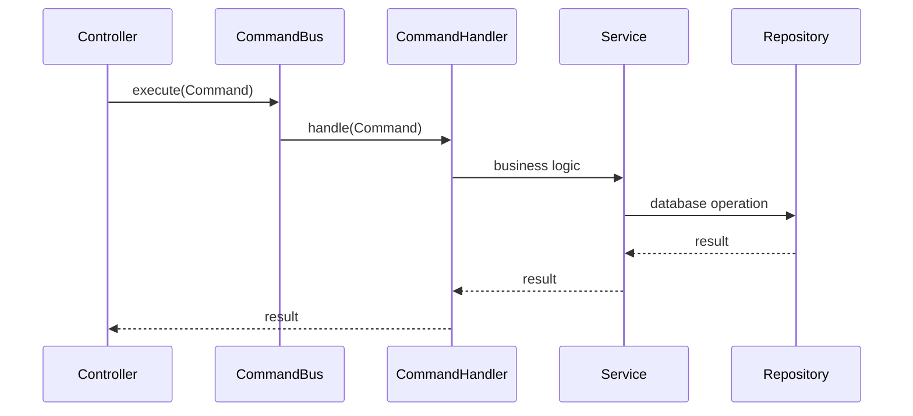

# CQRS Handlers Reference

Command Query Responsibility Segregation patterns in Ever Gauzy.

## Overview

Gauzy uses NestJS CQRS (`@nestjs/cqrs`) to separate write operations (commands) from read operations (queries). This provides:

- Clear separation of concerns
- Easy testing of business logic
- Event-driven side effects

## Command Pattern

### Defining a Command

```typescript
export class CreateOrganizationSprintCommand implements ICommand {
  constructor(public readonly input: IOrganizationSprintCreateInput) {}
}
```

### Handling a Command

```typescript
@CommandHandler(CreateOrganizationSprintCommand)
export class CreateOrganizationSprintHandler implements ICommandHandler<CreateOrganizationSprintCommand> {
  constructor(private readonly sprintService: OrganizationSprintService) {}

  async execute(command: CreateOrganizationSprintCommand) {
    const { input } = command;
    return await this.sprintService.create(input);
  }
}
```

### Dispatching a Command

```typescript
@Post('/')
async create(@Body() entity: CreateSprintDTO) {
  return await this.commandBus.execute(
    new CreateOrganizationSprintCommand(entity)
  );
}
```

## Command Flow



## Common Patterns

| Pattern                 | Description                       |
| ----------------------- | --------------------------------- |
| Create commands         | Entity creation with side effects |
| Update commands         | Entity updates with validation    |
| Composite commands      | Multi-step operations             |
| Event-emitting commands | Trigger events after execution    |

## Related Pages

- [Plugin Development Guide](../plugins/plugin-development-guide) — creating plugins with CQRS
- [Architecture Overview](../architecture/overview) — system architecture
