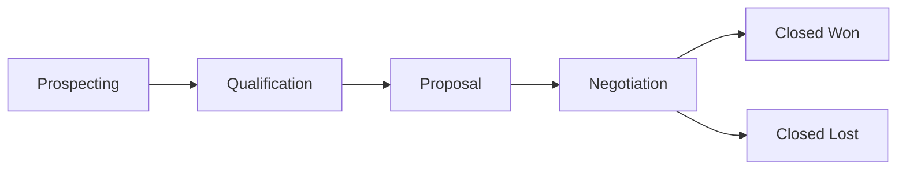

# Pipeline & Deal Endpoints

Manage sales pipelines with multiple stages and deals that progress through the pipeline.

## Base Paths

| Resource  | Path             |
| --------- | ---------------- |
| Pipelines | `/api/pipelines` |
| Deals     | `/api/deals`     |

## Pipeline Endpoints

### List Pipelines (Paginated)

```
GET /api/pipelines/pagination
Authorization: Bearer {token}
```

### Find All Pipelines

```
GET /api/pipelines
Authorization: Bearer {token}
```

### Get Pipeline by ID

```
GET /api/pipelines/:id
Authorization: Bearer {token}
```

### Get Pipeline Deals

Retrieves all deals associated with a specific pipeline.

```
GET /api/pipelines/:pipelineId/deals
Authorization: Bearer {token}
```

### Create Pipeline

```
POST /api/pipelines
Authorization: Bearer {token}
Content-Type: application/json

{
  "name": "Enterprise Sales",
  "description": "Pipeline for enterprise deals",
  "organizationId": "uuid",
  "stages": [
    { "name": "Prospecting", "index": 0 },
    { "name": "Qualification", "index": 1 },
    { "name": "Proposal", "index": 2 },
    { "name": "Negotiation", "index": 3 },
    { "name": "Closed Won", "index": 4 }
  ]
}
```

### Update Pipeline

```
PUT /api/pipelines/:id
Authorization: Bearer {token}
Content-Type: application/json

{
  "name": "Updated Pipeline Name"
}
```

### Delete Pipeline

```
DELETE /api/pipelines/:id
Authorization: Bearer {token}
```

## Deal Endpoints

### List Deals

```
GET /api/deals
Authorization: Bearer {token}
```

### Get Deal by ID

```
GET /api/deals/:id
Authorization: Bearer {token}
```

### Create Deal

```
POST /api/deals
Authorization: Bearer {token}
Content-Type: application/json

{
  "title": "Acme Corp Enterprise License",
  "stageId": "stage-uuid",
  "clientId": "contact-uuid",
  "probability": 75
}
```

### Update Deal

```
PUT /api/deals/:id
Authorization: Bearer {token}
Content-Type: application/json

{
  "stageId": "next-stage-uuid",
  "probability": 90
}
```

### Delete Deal

```
DELETE /api/deals/:id
Authorization: Bearer {token}
```

## Data Model

```typescript
interface IPipeline {
  id: string;
  name: string;
  description?: string;
  isActive: boolean;
  stages?: IPipelineStage[];
  organizationId: string;
  tenantId: string;
}

interface IPipelineStage {
  id: string;
  name: string;
  index: number;
  description?: string;
  pipelineId: string;
  deals?: IDeal[];
}

interface IDeal {
  id: string;
  title: string;
  probability?: number;
  stageId: string;
  stage?: IPipelineStage;
  clientId?: string;
  client?: IOrganizationContact;
  createdByUserId?: string;
  tenantId: string;
}
```

## Pipeline Flow



## Permissions

| Action             | Required Permission    |
| ------------------ | ---------------------- |
| View pipelines     | `VIEW_SALES_PIPELINES` |
| Create/edit/delete | `EDIT_SALES_PIPELINES` |

## Related Pages

- [Sales Pipelines Feature](../features/sales-pipelines) — feature guide
- [Contact Endpoints](./contact-endpoints) — CRM contacts
- [CRM Overview](../features/crm-overview) — CRM module
