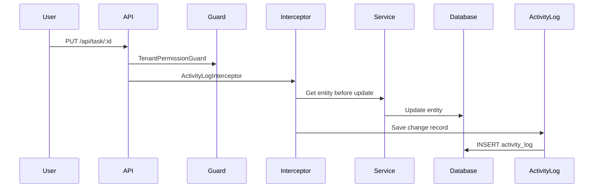

# Audit Logging Architecture

How entity changes are tracked for compliance and traceability.

## Overview

The audit logging system records:

- Who changed what entity
- What changed (old vs new values)
- When it changed
- IP address and request context

## Activity Log Flow



## ActivityLog Entity

| Column         | Type     | Description               |
| -------------- | -------- | ------------------------- |
| `id`           | UUID     | Log entry ID              |
| `entity`       | string   | Entity name               |
| `entityId`     | UUID     | ID of changed entity      |
| `action`       | enum     | CREATED, UPDATED, DELETED |
| `actorType`    | enum     | USER, SYSTEM              |
| `actorId`      | UUID     | User who made the change  |
| `data`         | JSON     | New values                |
| `previousData` | JSON     | Old values                |
| `ipAddress`    | string   | Client IP                 |
| `createdAt`    | datetime | Timestamp                 |

## Using the Decorator

```typescript
@ActivityLog('TASK_UPDATED')
@Put(':id')
async update(@Param('id') id: string, @Body() dto: UpdateTaskDTO) {
  return this.taskService.update(id, dto);
}
```

## Querying Logs

```
GET /api/activity-log?entity=Task&entityId=uuid&action=UPDATED
```

## Related Pages

- [Activity Log Endpoints](../api/activity-log-endpoints) — activity API
- [Decorator System](./decorator-system) — custom decorators
