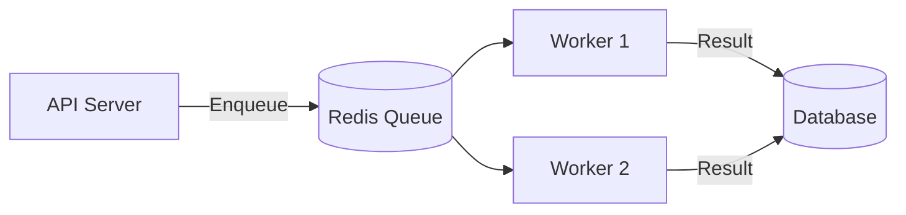

# Background Job Architecture

Worker processes, job queues, and scheduled tasks.

## Overview

Gauzy uses BullMQ (Redis-backed) for background job processing:



## Job Types

| Queue         | Jobs                           |
| ------------- | ------------------------------ |
| `email`       | Send emails, notifications     |
| `integration` | Sync with third-party services |
| `screenshot`  | Process screenshots            |
| `export`      | Export data to CSV/Excel       |
| `import`      | Import data from files         |
| `cleanup`     | Archive/delete old data        |

## Creating a Job

```typescript
@Injectable()
export class EmailService {
  constructor(@InjectQueue("email") private emailQueue: Queue) {}

  async sendWelcomeEmail(userId: string) {
    await this.emailQueue.add(
      "welcome",
      {
        userId,
        template: "welcome",
      },
      {
        attempts: 3,
        backoff: { type: "exponential", delay: 5000 },
      },
    );
  }
}
```

## Processing a Job

```typescript
@Processor("email")
export class EmailProcessor {
  @Process("welcome")
  async handleWelcome(job: Job) {
    const { userId, template } = job.data;
    await this.mailerService.send(userId, template);
  }
}
```

## Scheduled Tasks

```typescript
@Injectable()
export class CleanupService {
  @Cron("0 0 * * *") // Daily at midnight
  async cleanOldLogs() {
    await this.activityLogService.deleteOlderThan(90);
  }
}
```

## Monitoring

Use Bull Dashboard for queue monitoring:

```
GET /admin/queues
```

## Related Pages

- [Worker Architecture](./worker-architecture) — worker process
- [Redis & Caching](../advanced/redis-and-caching) — Redis infrastructure
- [Scaling & HA](../devops/scaling) — scaling workers
