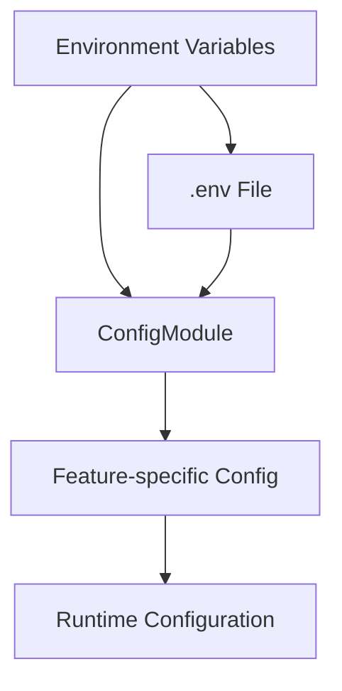

# Configuration System

How Gauzy manages environment-based configuration across all modules.

## Overview

Gauzy uses a layered configuration approach:



## ConfigModule

NestJS `@nestjs/config` module for centralized configuration:

```typescript
@Module({
  imports: [
    ConfigModule.forRoot({
      isGlobal: true,
      envFilePath: ".env",
      load: [databaseConfig, jwtConfig, fileStorageConfig],
    }),
  ],
})
export class AppModule {}
```

## Configuration Namespaces

| Namespace     | File                  | Description       |
| ------------- | --------------------- | ----------------- |
| `database`    | `database.config.ts`  | DB connection     |
| `jwt`         | `jwt.config.ts`       | JWT settings      |
| `fileStorage` | `file-storage.config` | Storage provider  |
| `email`       | `email.config.ts`     | SMTP settings     |
| `social`      | `social.config.ts`    | OAuth credentials |

## Accessing Configuration

```typescript
@Injectable()
export class MyService {
  constructor(private configService: ConfigService) {}

  getDbHost(): string {
    return this.configService.get<string>("database.host", "localhost");
  }
}
```

## Environment Files

| File              | Purpose             |
| ----------------- | ------------------- |
| `.env`            | Local development   |
| `.env.local`      | Local overrides     |
| `.env.staging`    | Staging environment |
| `.env.production` | Production settings |

## Validation

Configuration is validated at startup using `class-validator`:

```typescript
export class EnvironmentVariables {
  @IsString()
  DB_HOST: string;

  @IsNumber()
  @Min(1)
  @Max(65535)
  DB_PORT: number;
}
```

## Related Pages

- [Environment Variables](../devops/environment-variables) — complete variable list
- [Production Deployment](../devops/production-deployment) — deployment config
