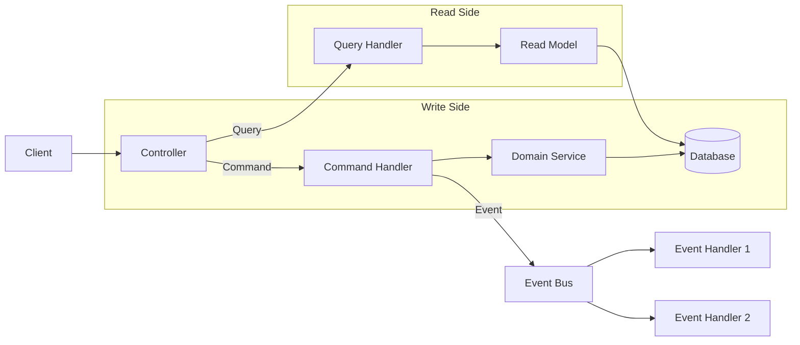

# CQRS Pattern

Command Query Responsibility Segregation in Gauzy.

## Overview

CQRS separates read and write operations into different models. Gauzy uses NestJS's `@nestjs/cqrs` module for complex domain operations.

## Architecture



## Commands

```typescript
// Command definition
export class CreateTimerCommand {
  constructor(
    public readonly input: ITimerToggleInput,
    public readonly requestContext: RequestContext,
  ) {}
}

// Command handler
@CommandHandler(CreateTimerCommand)
export class CreateTimerHandler implements ICommandHandler<CreateTimerCommand> {
  async execute(command: CreateTimerCommand): Promise<ITimeLog> {
    const { input, requestContext } = command;
    // Business logic here
    return this.timeLogService.create(input);
  }
}
```

## Queries

```typescript
// Query definition
export class GetTimerStatusQuery {
  constructor(public readonly employeeId: string) {}
}

// Query handler
@QueryHandler(GetTimerStatusQuery)
export class GetTimerStatusHandler implements IQueryHandler<GetTimerStatusQuery> {
  async execute(query: GetTimerStatusQuery): Promise<ITimerStatus> {
    return this.timerService.getStatus(query.employeeId);
  }
}
```

## Events

```typescript
// Event
export class TimerStartedEvent {
  constructor(public readonly timeLog: ITimeLog) {}
}

// Event handler
@EventsHandler(TimerStartedEvent)
export class TimerStartedHandler implements IEventHandler<TimerStartedEvent> {
  handle(event: TimerStartedEvent) {
    // Side effects: notifications, activity log, WebSocket broadcast
    this.notificationService.notify(event.timeLog.employeeId, "Timer started");
    this.wsGateway.emit("timer:started", event.timeLog);
  }
}
```

## When to Use CQRS

| Use CQRS               | Use Simple CRUD        |
| ---------------------- | ---------------------- |
| Complex business logic | Simple data operations |
| Multiple side effects  | No side effects        |
| Event-driven workflows | Basic CRUD             |
| Audit trail required   | Low complexity         |

## Related Pages

- [Service Layer Patterns](./service-layer-patterns) — service architecture
- [Event Bus Architecture](./event-bus) — events
- [Background Jobs](./background-jobs) — async processing
