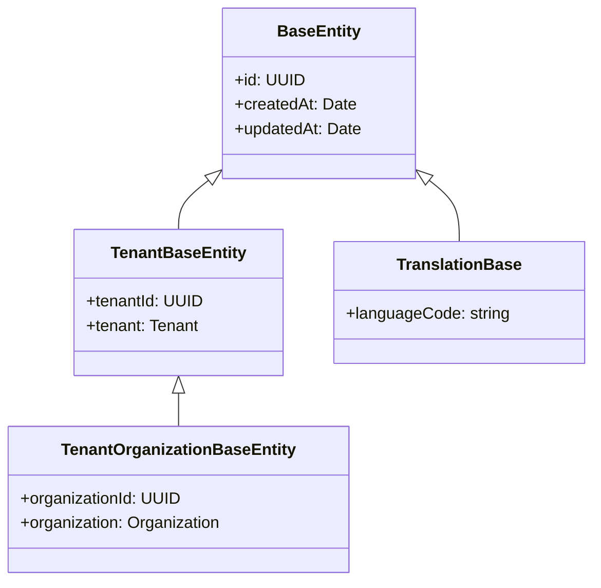

# Entity Inheritance Hierarchy

Understanding the base class hierarchy for all database entities.

## Inheritance Tree



## BaseEntity

The root class for all entities:

```typescript
export abstract class BaseEntity {
  @PrimaryGeneratedColumn("uuid")
  id: string;

  @CreateDateColumn()
  createdAt: Date;

  @UpdateDateColumn()
  updatedAt: Date;

  @Column({ nullable: true })
  isActive?: boolean;

  @Column({ nullable: true })
  isArchived?: boolean;

  @DeleteDateColumn()
  deletedAt?: Date;

  @Column({ nullable: true })
  archivedAt?: Date;
}
```

## TenantBaseEntity

Adds tenant scoping:

```typescript
export abstract class TenantBaseEntity extends BaseEntity {
  @Column({ nullable: true })
  tenantId: string;

  @ManyToOne(() => Tenant)
  tenant?: Tenant;
}
```

**Usage:** Entities scoped to a tenant but not organization-specific (e.g., Role, User settings).

## TenantOrganizationBaseEntity

Adds organization scoping:

```typescript
export abstract class TenantOrganizationBaseEntity extends TenantBaseEntity {
  @Column({ nullable: true })
  organizationId: string;

  @ManyToOne(() => Organization)
  organization?: Organization;
}
```

**Usage:** Most business entities (Task, Employee, Invoice, etc.).

## TranslationBase

For multi-language content:

```typescript
export abstract class TranslationBase extends BaseEntity {
  @Column()
  languageCode: string;
}
```

**Usage:** ProductTranslation, ProductCategoryTranslation, etc.

## Which Base Class to Use

| Scenario                   | Base Class                     |
| -------------------------- | ------------------------------ |
| System-level entity        | `BaseEntity`                   |
| Tenant-scoped              | `TenantBaseEntity`             |
| Organization-scoped (most) | `TenantOrganizationBaseEntity` |
| Translatable content       | `TranslationBase`              |

## Related Pages

- [Core Entities](../database/entity-reference/core-entities) — User, Tenant, Org
- [Multi-ORM Deep Dive](../advanced/multi-orm-deep-dive) — ORM decorators
- [Plugin Development Guide](../plugins/plugin-development-guide) — using base classes
