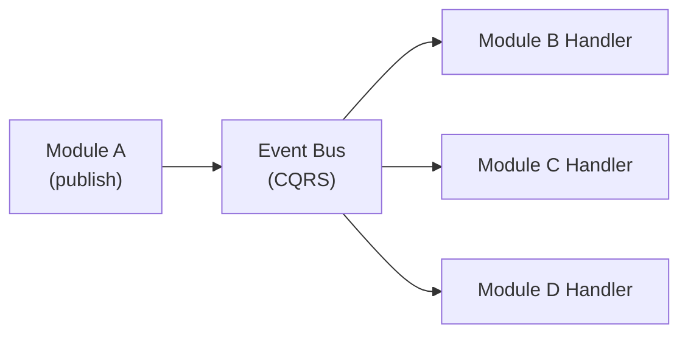

# Event Bus

Ever Gauzy uses NestJS CQRS events for inter-module communication, enabling decoupled, event-driven architecture across the platform.

## Architecture

The event bus allows modules to communicate without direct dependencies:



## Core Concepts

### Events

Events represent something that **has happened** in the system:

```typescript
// Event definition
export class EmployeeCreatedEvent implements IEvent {
  constructor(
    public readonly employee: IEmployee,
    public readonly tenantId: string,
  ) {}
}
```

### Event Handlers

Event handlers react to published events:

```typescript
@EventsHandler(EmployeeCreatedEvent)
export class EmployeeCreatedHandler implements IEventHandler<EmployeeCreatedEvent> {
  constructor(
    private readonly emailService: EmailService,
    private readonly activityLogService: ActivityLogService,
  ) {}

  async handle(event: EmployeeCreatedEvent): Promise<void> {
    const { employee, tenantId } = event;

    // Send welcome email
    await this.emailService.sendWelcomeEmail(employee);

    // Log activity
    await this.activityLogService.logActivity({
      entity: "Employee",
      entityId: employee.id,
      action: "CREATE",
      tenantId,
    });
  }
}
```

### Publishing Events

Events are published through the `EventBus`:

```typescript
@Injectable()
export class EmployeeService {
  constructor(private readonly eventBus: EventBus) {}

  async createEmployee(input: IEmployeeCreateInput): Promise<IEmployee> {
    const employee = await this.repository.save(input);

    // Publish event for other modules to react
    this.eventBus.publish(
      new EmployeeCreatedEvent(employee, RequestContext.currentTenantId()),
    );

    return employee;
  }
}
```

## Common Events

### Entity Lifecycle Events

| Event                      | Published When              |
| -------------------------- | --------------------------- |
| `EmployeeCreatedEvent`     | New employee record created |
| `EmployeeUpdatedEvent`     | Employee data modified      |
| `OrganizationCreatedEvent` | New organization created    |
| `UserRegisteredEvent`      | New user registered         |
| `InviteAcceptedEvent`      | User accepts an invitation  |

### Time Tracking Events

| Event                     | Published When                   |
| ------------------------- | -------------------------------- |
| `TimeLogCreatedEvent`     | Time log entry recorded          |
| `TimeLogUpdatedEvent`     | Time log modified                |
| `TimeLogDeletedEvent`     | Time log removed                 |
| `TimesheetSubmittedEvent` | Timesheet submitted for approval |
| `TimesheetApprovedEvent`  | Timesheet approved               |

### Integration Events

| Event                  | Published When           |
| ---------------------- | ------------------------ |
| `IntegrationSyncEvent` | Integration data synced  |
| `GitHubWebhookEvent`   | GitHub webhook received  |
| `UpworkSyncEvent`      | Upwork data synchronized |

## Event Handler Registration

Event handlers are registered in their respective modules:

```typescript
@Module({
  providers: [
    // Register event handlers
    EmployeeCreatedHandler,
    EmployeeUpdatedHandler,
  ],
})
export class EmployeeModule {}
```

Multiple handlers can listen to the same event:

```typescript
// In Notification Module
@EventsHandler(EmployeeCreatedEvent)
export class SendWelcomeNotification implements IEventHandler<EmployeeCreatedEvent> {
  async handle(event: EmployeeCreatedEvent) {
    // Send notification
  }
}

// In Analytics Module
@EventsHandler(EmployeeCreatedEvent)
export class TrackEmployeeCreation implements IEventHandler<EmployeeCreatedEvent> {
  async handle(event: EmployeeCreatedEvent) {
    // Track analytics
  }
}
```

## Activity Log Integration

The event bus powers the **Activity Log** system, which records all significant actions:

```typescript
@EventsHandler(EmployeeCreatedEvent, TaskCreatedEvent, InvoiceCreatedEvent)
export class ActivityLogHandler implements IEventHandler {
  constructor(private readonly activityLogService: ActivityLogService) {}

  async handle(event: any) {
    await this.activityLogService.log({
      entityType: event.constructor.name,
      entityId: event.entity?.id,
      action: "CREATE",
      description: `${event.constructor.name} triggered`,
      actorId: RequestContext.currentUserId(),
      tenantId: RequestContext.currentTenantId(),
    });
  }
}
```

## Best Practices

### DO

- ✅ Use events for cross-module communication
- ✅ Keep event handlers idempotent
- ✅ Include `tenantId` in all events for multi-tenant support
- ✅ Handle errors gracefully in event handlers (don't break the publisher)
- ✅ Use descriptive event names

### DON'T

- ❌ Use events for synchronous request-response patterns (use Commands/Queries instead)
- ❌ Throw exceptions in event handlers that should propagate to the caller
- ❌ Depend on event handler execution order
- ❌ Store large payloads in events (reference IDs instead)

## Related Pages

- [Backend Architecture](./backend-architecture) — NestJS CQRS patterns
- [Plugin System](./plugin-system) — plugins and events
