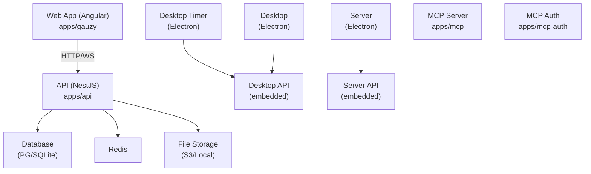

# Microservices & Applications

Overview of all applications in the Ever Gauzy monorepo and their roles.

## Application Catalog

| App               | Path                 | Description                         |
| ----------------- | -------------------- | ----------------------------------- |
| **API**           | `apps/api`           | Main NestJS REST/GraphQL API server |
| **Gauzy (Web)**   | `apps/gauzy`         | Angular admin dashboard             |
| **Desktop Timer** | `apps/desktop-timer` | Electron time tracking app          |
| **Desktop**       | `apps/desktop`       | Electron full desktop app           |
| **Desktop API**   | `apps/desktop-api`   | Embedded API for desktop apps       |
| **Server**        | `apps/server`        | Electron server app (local API)     |
| **Server API**    | `apps/server-api`    | API bundled for server app          |
| **MCP**           | `apps/mcp`           | MCP server for AI integration       |
| **MCP Auth**      | `apps/mcp-auth`      | OAuth 2.0 server for MCP            |
| **Server MCP**    | `apps/server-mcp`    | Desktop embedded MCP server         |
| **Agent**         | `apps/agent`         | AI agent application                |
| **E2E Tests**     | `apps/gauzy-e2e`     | End-to-end test suite               |

## Architecture

## Communication Patterns

| Source → Target       | Protocol           | Purpose                |
| --------------------- | ------------------ | ---------------------- |
| Web → API             | HTTP/REST, GraphQL | CRUD operations        |
| Desktop → API         | HTTP/REST          | Time logs, screenshots |
| Desktop → Desktop API | HTTP (localhost)   | Offline operations     |
| MCP → API             | HTTP/REST          | AI tool execution      |
| MCP Auth → API        | HTTP               | OAuth token validation |
| API → Redis           | TCP                | Caching, pub/sub       |
| API → Database        | TCP                | Data persistence       |

## Related Pages

- [Architecture Overview](./overview)
- [Backend Architecture](./backend-architecture)
- [MCP Server](../mcp-server/mcp-overview)
