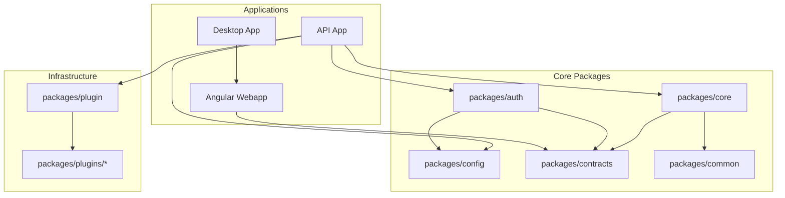
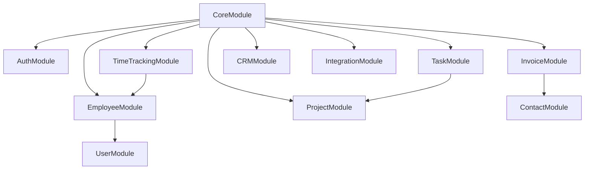

# Module Dependency Graph

Understanding the module dependency tree and key architectural layers.

## High-Level Architecture



## Core Module Dependencies

The `@gauzy/core` package is the largest, containing all API modules:



## Package Responsibilities

| Package     | Responsibility                    |
| ----------- | --------------------------------- |
| `contracts` | TypeScript interfaces, enums      |
| `common`    | Shared utilities, helpers         |
| `config`    | Configuration management          |
| `auth`      | Authentication & authorization    |
| `core`      | All business logic modules        |
| `plugin`    | Plugin infrastructure             |
| `plugins/*` | Individual plugin implementations |

## NX Dependency Graph

Visualize the full dependency graph:

```bash
npx nx graph
```

## Related Pages

- [Monorepo Structure](./monorepo-structure) — repo layout
- [Backend Architecture](./backend-architecture) — backend overview
- [Monorepo Navigation](../development/monorepo-navigation) — dev guide
