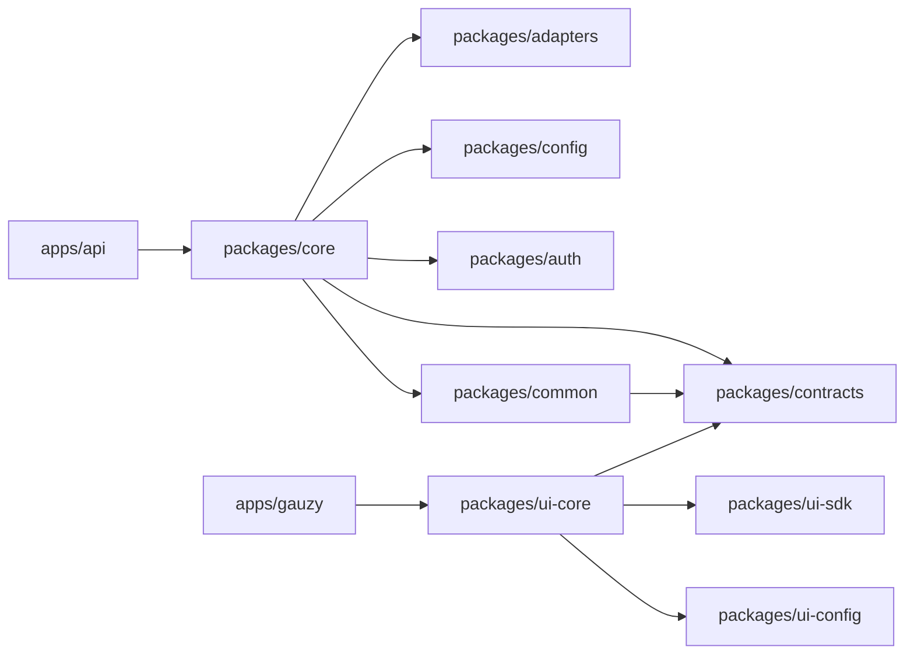

# Monorepo Structure

Ever Gauzy uses an **NX-managed monorepo** with Lerna for package management. The repository contains multiple applications, libraries, and plugins organized in a structured hierarchy.

## Root Directory Layout

```
ever-gauzy/
├── .circleci/              # CircleCI CI/CD configuration
├── .deploy/                # Deployment configurations
│   ├── api/                # API Docker configs
│   ├── db/                 # Database init scripts
│   ├── desktop/            # Desktop app deployment
│   ├── desktop-timer/      # Desktop timer deployment
│   ├── jitsu/              # Jitsu data ingestion config
│   ├── k8s/                # Kubernetes manifests
│   ├── mcp/                # MCP server Docker config
│   ├── mcp-auth/           # MCP auth server Docker config
│   ├── redis/              # Redis configuration
│   ├── ssh/                # SSH key management
│   └── webapp/             # Web app deployment
├── .github/                # GitHub Actions workflows
├── .scripts/               # Build & configuration scripts
├── apps/                   # Application projects
├── packages/               # Library packages
├── docker-compose*.yml     # Docker Compose files
├── nx.json                 # NX workspace configuration
├── angular.json            # Angular workspace configuration
├── tsconfig.base.json      # Base TypeScript configuration
├── package.json            # Root package.json
├── lerna.json              # Lerna configuration
└── .env.sample             # Environment variable template
```

## Applications (`apps/`)

Applications are deployable end-user products:

| Application        | Path                 | Type     | Description                               |
| ------------------ | -------------------- | -------- | ----------------------------------------- |
| **API**            | `apps/api`           | NestJS   | Main backend API server                   |
| **Gauzy (Web UI)** | `apps/gauzy`         | Angular  | Primary web interface                     |
| **Desktop**        | `apps/desktop`       | Electron | All-in-one desktop app (UI + API + Timer) |
| **Desktop Timer**  | `apps/desktop-timer` | Electron | Standalone time & activity tracker        |
| **Server**         | `apps/server`        | Electron | Desktop server app (embeds API)           |
| **API Server**     | `apps/api-server`    | Electron | API-only desktop server                   |
| **Server-API**     | `apps/server-api`    | NestJS   | Server-side API module                    |
| **Server-UI**      | `apps/server-ui`     | Angular  | Server app UI                             |
| **Desktop-UI**     | `apps/desktop-ui`    | Angular  | Desktop app UI                            |
| **Gauzy-E2E**      | `apps/gauzy-e2e`     | Cypress  | End-to-end tests                          |
| **MCP**            | `apps/mcp`           | Node.js  | Model Context Protocol server             |
| **MCP Auth**       | `apps/mcp-auth`      | Node.js  | MCP OAuth 2.0 server                      |

## Packages (`packages/`)

Packages are shared libraries consumed by applications:

### Core Libraries

| Package              | Path                 | Purpose                                                         |
| -------------------- | -------------------- | --------------------------------------------------------------- |
| **@gauzy/core**      | `packages/core`      | Core backend module — entities, services, controllers, guards   |
| **@gauzy/common**    | `packages/common`    | Shared constants, enums, interfaces, and utilities              |
| **@gauzy/contracts** | `packages/contracts` | TypeScript interfaces/types shared between frontend and backend |
| **@gauzy/config**    | `packages/config`    | Configuration management and environment loading                |

### Authentication & Security

| Package         | Path            | Purpose                                                    |
| --------------- | --------------- | ---------------------------------------------------------- |
| **@gauzy/auth** | `packages/auth` | Authentication strategies (JWT, Social OAuth, Magic Login) |

### Database & ORM

| Package             | Path                | Purpose                                          |
| ------------------- | ------------------- | ------------------------------------------------ |
| **@gauzy/adapters** | `packages/adapters` | Multi-ORM adapter layer for TypeORM and MikroORM |

### Desktop

| Package                   | Path                      | Purpose                           |
| ------------------------- | ------------------------- | --------------------------------- |
| **@gauzy/desktop-libs**   | `packages/desktop-libs`   | Desktop app shared libraries      |
| **@gauzy/desktop-ui-lib** | `packages/desktop-ui-lib` | Desktop app Angular UI components |
| **@gauzy/desktop-window** | `packages/desktop-window` | Electron window management        |

### UI Libraries

| Package              | Path                 | Purpose                                      |
| -------------------- | -------------------- | -------------------------------------------- |
| **@gauzy/ui-config** | `packages/ui-config` | UI configuration and feature flags           |
| **@gauzy/ui-core**   | `packages/ui-core`   | Core Angular components, services, and pipes |
| **@gauzy/ui-sdk**    | `packages/ui-sdk`    | SDK for building UI extensions               |

### Plugins

| Package                                    | Path                                               | Purpose                        |
| ------------------------------------------ | -------------------------------------------------- | ------------------------------ |
| **@gauzy/plugin-changelog**                | `packages/plugins/plugin-changelog`                | Changelog and audit trail      |
| **@gauzy/plugin-integration-ai**           | `packages/plugins/plugin-integration-ai`           | Gauzy AI integration           |
| **@gauzy/plugin-integration-github**       | `packages/plugins/plugin-integration-github`       | GitHub integration             |
| **@gauzy/plugin-integration-hubstaff**     | `packages/plugins/plugin-integration-hubstaff`     | HubStaff integration           |
| **@gauzy/plugin-integration-jira**         | `packages/plugins/plugin-integration-jira`         | Jira integration               |
| **@gauzy/plugin-integration-make**         | `packages/plugins/plugin-integration-make`         | Make.com integration           |
| **@gauzy/plugin-integration-upwork**       | `packages/plugins/plugin-integration-upwork`       | Upwork integration             |
| **@gauzy/plugin-integration-zapier**       | `packages/plugins/plugin-integration-zapier`       | Zapier integration             |
| **@gauzy/plugin-integration-activepieces** | `packages/plugins/plugin-integration-activepieces` | ActivePieces integration       |
| **@gauzy/plugin-jitsu-analytics**          | `packages/plugins/jitsu-analytics`                 | Jitsu analytics plugin         |
| **@gauzy/plugin-job-search**               | `packages/plugins/job-search`                      | Job board search integration   |
| **@gauzy/plugin-job-search-ui**            | `packages/plugins/job-search-ui`                   | Job search UI components       |
| **@gauzy/plugin-job-matching-ui**          | `packages/plugins/job-matching-ui`                 | Job matching UI components     |
| **@gauzy/plugin-job-proposal-ui**          | `packages/plugins/job-proposal-ui`                 | Job proposal UI components     |
| **@gauzy/plugin-knowledge-base**           | `packages/plugins/knowledge-base`                  | Knowledge base and help center |
| **@gauzy/plugin-knowledge-base-ui**        | `packages/plugins/knowledge-base-ui`               | Knowledge base UI              |
| **@gauzy/plugin-legal-ui**                 | `packages/plugins/legal-ui`                        | Legal pages UI                 |
| **@gauzy/plugin-onboarding-ui**            | `packages/plugins/onboarding-ui`                   | Onboarding flow UI             |
| **@gauzy/plugin-product-reviews**          | `packages/plugins/product-reviews`                 | Product reviews module         |
| **@gauzy/plugin-sentry**                   | `packages/plugins/sentry`                          | Sentry error tracking          |

## NX Workspace Configuration

### `nx.json`

The NX configuration defines:

- **Task runners** — local and cloud (NX Cloud) task execution
- **Cache targets** — `build`, `test`, `lint` operations are cached
- **Task dependencies** — build order between projects
- **Default options** — output directories, test settings

### Task Graph

NX manages the dependency graph between projects automatically:



### Key NX Commands

```bash
# Run a target for a specific project
npx nx serve api
npx nx build gauzy

# Run affected targets (only changed projects)
npx nx affected --target=build
npx nx affected --target=test

# Visualize dependency graph
npx nx graph

# List all projects
npx nx show projects

# Run multiple targets
npx nx run-many --target=build --projects=api,gauzy
```

## TypeScript Configuration

The monorepo uses a hierarchical TSConfig setup:

```
tsconfig.base.json          # Base compiler options (strict, ES2022, paths)
├── apps/api/tsconfig.json
├── apps/gauzy/tsconfig.json
├── packages/core/tsconfig.json
└── packages/*/tsconfig.json
```

**Path aliases** are defined in `tsconfig.base.json`:

```json
{
  "compilerOptions": {
    "paths": {
      "@gauzy/core": ["packages/core/src/index.ts"],
      "@gauzy/common": ["packages/common/src/index.ts"],
      "@gauzy/contracts": ["packages/contracts/src/index.ts"],
      "@gauzy/config": ["packages/config/src/index.ts"],
      "@gauzy/auth": ["packages/auth/src/index.ts"],
      "@gauzy/adapters": ["packages/adapters/src/index.ts"],
      "@gauzy/ui-config": ["packages/ui-config/src/index.ts"],
      "@gauzy/ui-core/*": ["packages/ui-core/src/lib/*"]
    }
  }
}
```

## Build System

### Build Targets

| Target  | Description                  | Caching       |
| ------- | ---------------------------- | ------------- |
| `build` | Compile TypeScript / Angular | ✅ NX cached  |
| `serve` | Start dev server             | ❌ Not cached |
| `test`  | Run unit tests               | ✅ NX cached  |
| `lint`  | Run ESLint                   | ✅ NX cached  |
| `e2e`   | Run E2E tests                | ❌ Not cached |

### Build Order

NX automatically resolves build order via implicit and explicit dependencies. Key principles:

1. `@gauzy/contracts` builds first (no dependencies)
2. `@gauzy/common` builds next (depends on contracts)
3. `@gauzy/config` and `@gauzy/auth` build after common
4. `@gauzy/core` builds after all above
5. Applications (`api`, `gauzy`) build after their dependencies
6. Plugin packages build after `core` and relevant UI packages

## Related Pages

- [Technology Stack](./technology-stack) — frameworks and libraries used
- [Backend Architecture](./backend-architecture) — NestJS module structure
- [Frontend Architecture](./frontend-architecture) — Angular module structure
- [Development Guide](../development/development-guide) — working with NX in development
