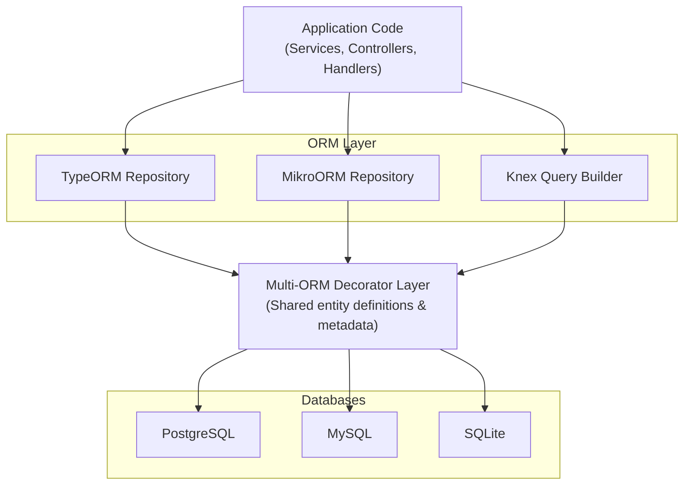

# Multi-ORM Architecture

Ever Gauzy uniquely supports **multiple ORMs simultaneously** — TypeORM, MikroORM, and Knex — allowing developers to choose the best tool for each use case while sharing the same entity definitions and database.

## Architecture Overview



## ORM Selection

The active ORM is configured via the `DB_ORM` environment variable:

```bash
# .env
DB_ORM=typeorm       # Options: typeorm | mikro-orm
```

### When to Use Each ORM

| ORM          | Best For                                                | Characteristics                                            |
| ------------ | ------------------------------------------------------- | ---------------------------------------------------------- |
| **TypeORM**  | General CRUD, complex relations, migrations             | Active Record + Data Mapper patterns, eager loading        |
| **MikroORM** | Strict data integrity, unit of work                     | Identity map, automatic change tracking, stricter metadata |
| **Knex**     | Raw SQL, complex aggregations, high-performance queries | Direct SQL control, query builder, raw performance         |

## Multi-ORM Decorators

The platform uses a custom **Multi-ORM decorator** system that generates metadata for both TypeORM and MikroORM from a single entity definition.

### Entity Definition

```typescript
import { MultiORMEntity, MultiORMColumn, MultiORMManyToOne } from "@gauzy/core";

@MultiORMEntity("employee")
export class Employee extends TenantOrganizationBaseEntity {
  @MultiORMColumn()
  firstName: string;

  @MultiORMColumn()
  lastName: string;

  @MultiORMColumn({ nullable: true })
  startedWorkOn?: Date;

  @MultiORMManyToOne(() => User, {
    nullable: false,
    onDelete: "CASCADE",
  })
  user: IUser;

  @MultiORMColumn({ relationId: true })
  userId: string;
}
```

### Decorator Mapping

| Multi-ORM Decorator     | TypeORM Equivalent | MikroORM Equivalent |
| ----------------------- | ------------------ | ------------------- |
| `@MultiORMEntity()`     | `@Entity()`        | `@Entity()`         |
| `@MultiORMColumn()`     | `@Column()`        | `@Property()`       |
| `@MultiORMManyToOne()`  | `@ManyToOne()`     | `@ManyToOne()`      |
| `@MultiORMOneToMany()`  | `@OneToMany()`     | `@OneToMany()`      |
| `@MultiORMManyToMany()` | `@ManyToMany()`    | `@ManyToMany()`     |
| `@MultiORMOneToOne()`   | `@OneToOne()`      | `@OneToOne()`       |

### Conditional Decorator Application

Decorators are conditionally applied based on the active ORM:

```typescript
export function MultiORMColumn(options?: ColumnOptions): PropertyDecorator {
  return (target, propertyKey) => {
    if (getDBORM() === "typeorm") {
      Column(options)(target, propertyKey);
    }
    if (getDBORM() === "mikro-orm") {
      Property(mapToMikroORMOptions(options))(target, propertyKey);
    }
  };
}
```

This prevents metadata conflicts when only one ORM is active at runtime.

## Base Entity Classes

### `BaseEntity`

The root entity class providing common fields:

```typescript
export abstract class BaseEntity {
  @MultiORMColumn({ primary: true })
  id: string;

  @MultiORMColumn({ createDate: true })
  createdAt: Date;

  @MultiORMColumn({ updateDate: true })
  updatedAt: Date;

  @MultiORMColumn({ nullable: true })
  isActive: boolean;

  @MultiORMColumn({ nullable: true })
  isArchived: boolean;
}
```

### `TenantBaseEntity`

Adds tenant scoping:

```typescript
export abstract class TenantBaseEntity extends BaseEntity {
  @MultiORMManyToOne(() => Tenant, { nullable: false })
  tenant: ITenant;

  @MultiORMColumn({ relationId: true })
  tenantId: string;
}
```

### `TenantOrganizationBaseEntity`

Adds organization scoping (most common base class):

```typescript
export abstract class TenantOrganizationBaseEntity extends TenantBaseEntity {
  @MultiORMManyToOne(() => Organization, { nullable: true })
  organization?: IOrganization;

  @MultiORMColumn({ relationId: true, nullable: true })
  organizationId?: string;
}
```

### Entity Hierarchy

```
BaseEntity
├── TenantBaseEntity
│   ├── User
│   ├── Role
│   ├── Tenant (self-referencing)
│   └── TenantOrganizationBaseEntity
│       ├── Employee
│       ├── OrganizationProject
│       ├── Task
│       ├── TimeLog
│       ├── Invoice
│       ├── Expense
│       ├── Contact
│       └── ... (most entities)
└── Model (non-DB entities)
```

## Repository Layer

### TypeORM Repositories

```typescript
@Injectable()
export class EmployeeService extends TenantAwareCrudService<Employee> {
  constructor(
    @InjectRepository(Employee)
    private readonly typeOrmEmployeeRepository: TypeOrmEmployeeRepository,
    private readonly mikroOrmEmployeeRepository: MikroOrmEmployeeRepository,
  ) {
    super(typeOrmEmployeeRepository, mikroOrmEmployeeRepository);
  }
}
```

### MikroORM Repositories

MikroORM uses the Unit of Work pattern with an EntityManager:

```typescript
@Injectable()
export class MikroOrmEmployeeRepository extends MikroOrmBaseEntityRepository<Employee> {
  constructor(em: EntityManager) {
    super(em, Employee);
  }
}
```

### Knex Queries

For complex queries that bypass ORM overhead:

```typescript
import { Knex } from "knex";

@Injectable()
export class ReportService {
  constructor(@InjectConnection() private readonly knex: Knex) {}

  async getTimeSummary(tenantId: string, options: ITimeLogFilters) {
    return this.knex("time_log")
      .select("employee_id")
      .sum("duration as totalDuration")
      .where("tenant_id", tenantId)
      .groupBy("employee_id");
  }
}
```

## Migrations

### TypeORM Migrations

TypeORM migrations are located in `packages/core/src/lib/database/migrations/`:

```bash
# Generate a new migration
yarn typeorm migration:generate -n MigrationName

# Run migrations
yarn typeorm migration:run

# Revert last migration
yarn typeorm migration:revert
```

### MikroORM Migrations

MikroORM uses its own migration system:

```bash
# Create migration
yarn mikro-orm migration:create

# Run migrations
yarn mikro-orm migration:up

# Revert
yarn mikro-orm migration:down
```

### Knex Migrations

Knex provides raw SQL migrations for complex schema changes:

```typescript
export async function up(knex: Knex): Promise<void> {
  await knex.schema.alterTable("employee", (table) => {
    table.string("new_field").nullable();
  });
}

export async function down(knex: Knex): Promise<void> {
  await knex.schema.alterTable("employee", (table) => {
    table.dropColumn("new_field");
  });
}
```

## Database Support Matrix

| Database           | TypeORM | MikroORM | Knex | Production Ready |
| ------------------ | ------- | -------- | ---- | ---------------- |
| **PostgreSQL**     | ✅      | ✅       | ✅   | ✅ Recommended   |
| **MySQL**          | ✅      | ✅       | ✅   | ✅               |
| **SQLite**         | ✅      | ✅       | ✅   | ⚠️ Dev/Demo only |
| **better-sqlite3** | ✅      | ✅       | ✅   | ⚠️ Dev/Demo only |
| **MariaDB**        | ✅      | ✅       | ✅   | ✅               |

## Best Practices

### DO

- ✅ Use `MultiORM*` decorators for all entity definitions
- ✅ Inject both TypeORM and MikroORM repositories in services
- ✅ Use `TenantAwareCrudService` for automatic tenant scoping
- ✅ Use Knex for complex aggregation queries
- ✅ Test with both TypeORM and MikroORM in CI

### DON'T

- ❌ Import TypeORM/MikroORM decorators directly (use Multi-ORM wrappers)
- ❌ Use `createQueryBuilder` without tenant filtering (see [Tenant Filtering](../database/tenant-filtering))
- ❌ Mix ORM-specific patterns in service classes
- ❌ Assume TypeORM-specific behavior (e.g., eager loading) works in MikroORM

## Related Pages

- [TypeORM Setup](../database/typeorm) — TypeORM-specific configuration
- [MikroORM Setup](../database/mikroorm) — MikroORM-specific configuration
- [Knex Setup](../database/knex) — Knex-specific configuration
- [Tenant Filtering](../database/tenant-filtering) — tenant bypass documentation
- [Multi-ORM Entities](../database/multi-orm-entities) — entity definition patterns
