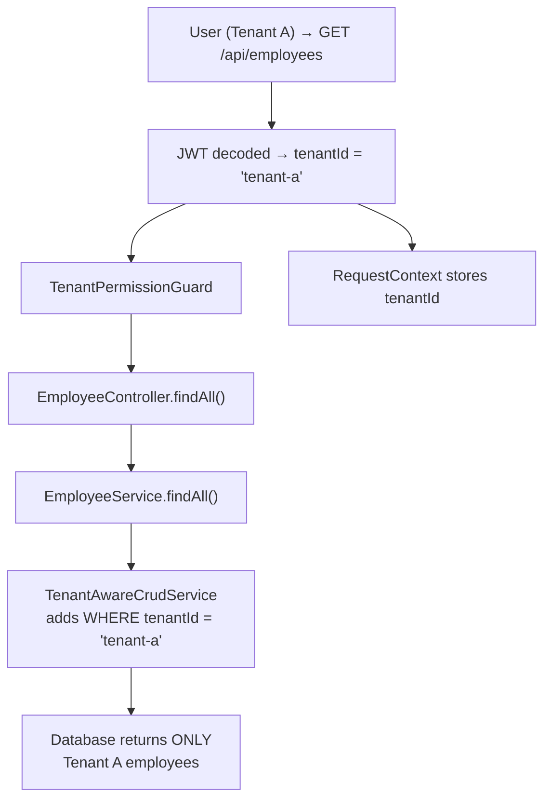

# Multi-Tenancy

Ever Gauzy is built as a **multi-tenant platform** where every piece of data is scoped to a specific tenant. This ensures complete data isolation between different organizations using the platform.

## Tenant Model

### What is a Tenant?

A **tenant** represents a top-level organizational boundary — typically a company or business entity that uses the Gauzy platform. Each tenant has:

- Its own users, employees, and organizations
- Isolated data (invoices, time logs, expenses, etc.)
- Independent configuration and settings
- Separate roles and permissions

### Tenant Hierarchy

```
Tenant (Company)
├── Organization A (Branch / Division)
│   ├── Department 1
│   │   ├── Team Alpha
│   │   └── Team Beta
│   ├── Department 2
│   └── Projects
│       ├── Project X
│       └── Project Y
├── Organization B
│   └── ...
└── Users
    ├── Super Admin (tenant-wide)
    ├── Admin (per organization)
    └── Employee (per organization)
```

## How Tenant Isolation Works

### Entity Base Classes

All tenant-scoped entities extend `TenantBaseEntity` or `TenantOrganizationBaseEntity`:

```typescript
// Tenant-scoped entity
export abstract class TenantBaseEntity extends BaseEntity {
  @MultiORMManyToOne(() => Tenant, { nullable: false })
  tenant: ITenant;

  @MultiORMColumn({ relationId: true })
  tenantId: string;
}

// Tenant + Organization scoped entity
export abstract class TenantOrganizationBaseEntity extends TenantBaseEntity {
  @MultiORMManyToOne(() => Organization, { nullable: true })
  organization?: IOrganization;

  @MultiORMColumn({ relationId: true, nullable: true })
  organizationId?: string;
}
```

### Automatic Tenant Filtering

The `TenantAwareCrudService` base class **automatically injects** the current tenant's ID into all queries:

```typescript
// In TenantAwareCrudService
async findAll(options?: FindManyOptions<T>): Promise<IPagination<T>> {
  const tenantId = RequestContext.currentTenantId();

  // Automatically adds WHERE tenant_id = :tenantId
  return super.findAll({
    ...options,
    where: {
      ...options?.where,
      tenantId,
    } as any,
  });
}
```

This means:

- **SELECT** queries only return data for the current tenant
- **INSERT** operations automatically set `tenantId`
- **UPDATE** and **DELETE** operations are scoped to the current tenant
- No tenant data leaks are possible through the service layer

### Request Context

The tenant is resolved from the JWT token on every request:

```
JWT Token → Auth Guard → Tenant Resolve → RequestContext.currentTenantId()
```

The `RequestContext` makes the tenant ID available throughout the request lifecycle:

```typescript
const tenantId = RequestContext.currentTenantId();
```

## Tenant Lifecycle

### 1. Tenant Creation

When a user registers publicly, a new tenant is created during onboarding:

```typescript
// TenantService.onboardTenant()
async onboardTenant(user: IUser, input: TenantInput): Promise<ITenant> {
  // Create tenant
  const tenant = await this.tenantRepository.save({
    name: input.name,
    id: uuidv4(),
  });

  // Create default roles for the tenant
  await this.roleService.createBulk(tenant.id);

  // Assign SUPER_ADMIN role to the creating user
  await this.userRepository.update(user.id, {
    tenantId: tenant.id,
    roleId: await this.findSuperAdminRole(tenant.id),
  });

  return tenant;
}
```

### 2. Organization Creation

Within a tenant, multiple organizations can be created:

```typescript
const organization = await this.organizationService.create({
  name: "Engineering Division",
  tenantId: RequestContext.currentTenantId(),
  currency: "USD",
  defaultValueDateType: "TODAY",
});
```

### 3. User-Tenant Association

Users are always associated with exactly one tenant:

```
User (id, email, tenantId, roleId)
  └── tenantId references Tenant(id)
```

## Tenant Filtering Bypasses

Some scenarios intentionally bypass tenant filtering. These are documented in detail in the [Tenant Filtering](../database/tenant-filtering) page.

### Categories of Bypass

| Category                   | Justification                               | Example                                                |
| -------------------------- | ------------------------------------------- | ------------------------------------------------------ |
| **Cross-Tenant by Design** | Must query across all tenants               | `TenantService.findAll()`, `UserService.findByEmail()` |
| **Manual QueryBuilder**    | Complex queries using `createQueryBuilder`  | Aggregation queries, reporting                         |
| **Plugin Services**        | Integration plugins that sync external data | GitHub sync, Upwork import                             |
| **Base Class Internal**    | Internal ORM operations                     | `CrudService` base methods                             |

### Security Rules for Bypasses

1. Every bypass **must be documented** in the tenant filtering doc
2. Manual `createQueryBuilder` calls **must include** `tenantId` in WHERE clauses
3. Cross-tenant queries require **SUPER_ADMIN** role guard
4. New services must use `TenantAwareCrudService` unless explicitly justified

## Multi-Tenant Guards

### TenantPermissionGuard

The primary guard that enforces tenant isolation at the API level:

```typescript
@UseGuards(TenantPermissionGuard)
@Controller("employee")
export class EmployeeController {
  // All endpoints automatically scoped to the user's tenant
}
```

### OrganizationPermissionGuard

For endpoints that require organization-level access:

```typescript
@UseGuards(OrganizationPermissionGuard)
@Controller("project")
export class ProjectController {
  // Endpoints scoped to user's organization within their tenant
}
```

## Data Flow Example



## Configuration

### Allow Super Admin Role

```bash
# .env
ALLOW_SUPER_ADMIN_ROLE=true    # Allow creating Super Admin users
```

When disabled, no new SUPER_ADMIN users can be created, enhancing security for production multi-tenant deployments.

## Best Practices

### DO

- ✅ Extend `TenantAwareCrudService` for all new services
- ✅ Use `TenantOrganizationBaseEntity` for new entities
- ✅ Document any tenant filtering bypasses
- ✅ Use `RequestContext.currentTenantId()` in manual queries
- ✅ Apply `TenantPermissionGuard` to all controllers

### DON'T

- ❌ Use `Repository.find()` directly (bypasses tenant filtering)
- ❌ Create entities without extending `TenantBaseEntity`
- ❌ Allow users to specify `tenantId` in request bodies (use RequestContext)
- ❌ Query across tenants without SUPER_ADMIN authorization

## Related Pages

- [Tenant Filtering](../database/tenant-filtering) — detailed bypass documentation
- [Roles and Permissions](../authentication/roles-and-permissions) — role hierarchy
- [Registration and Onboarding](../authentication/registration-and-onboarding) — tenant creation flow
- [Backend Architecture](./backend-architecture) — guard architecture
