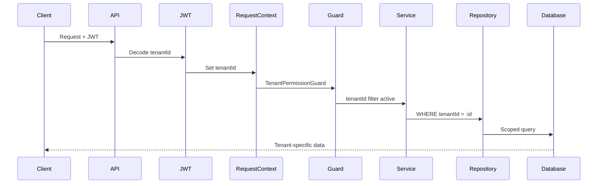

# Multi-Tenant Data Flow

How requests are scoped to tenants throughout the stack.

## Request Flow



## Layer-by-Layer

### 1. JWT Token

Every JWT contains the `tenantId`:

```json
{
  "id": "user-uuid",
  "tenantId": "tenant-uuid",
  "role": "ADMIN",
  "exp": 1735689600
}
```

### 2. RequestContext

`RequestContext` stores the current tenant in async local storage:

```typescript
RequestContext.currentTenantId(); // returns tenant UUID
```

### 3. Guard Layer

`TenantPermissionGuard` validates:

- Token contains valid `tenantId`
- Tenant exists and is active

### 4. Service Layer

All services extend `TenantAwareCrudService` which auto-filters by tenant:

```typescript
// Automatically adds WHERE tenantId = :currentTenant
const tasks = await this.taskService.findAll();
```

### 5. Repository Layer

Query builders append tenant filter:

```sql
SELECT * FROM task
WHERE "tenantId" = 'tenant-uuid'
  AND "organizationId" = 'org-uuid'
```

## Cross-Tenant Access

Only `SUPER_ADMIN` role can access data across tenants.

## Related Pages

- [Tenant Isolation](../security/tenant-isolation) — security deep dive
- [Multi-Tenancy](./multi-tenancy) — architecture overview
- [Request Lifecycle](./request-lifecycle) — full request flow
