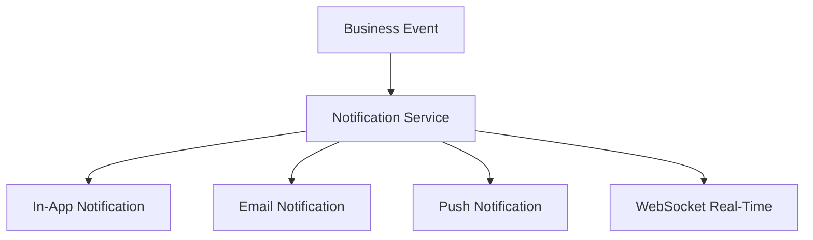

# Notification Architecture

How notifications flow through the Gauzy system.

## Notification Channels



## Channel Matrix

| Event               | In-App | Email | Push | WebSocket |
| ------------------- | ------ | ----- | ---- | --------- |
| Task assigned       | ✅     | ✅    | ✅   | ✅        |
| Timesheet submitted | ✅     | ✅    | ❌   | ✅        |
| Timesheet approved  | ✅     | ✅    | ✅   | ✅        |
| Invoice sent        | ✅     | ✅    | ❌   | ❌        |
| @mention            | ✅     | ✅    | ✅   | ✅        |
| Team update         | ✅     | ❌    | ❌   | ✅        |
| Timer started       | ❌     | ❌    | ❌   | ✅        |

## Service Implementation

```typescript
@Injectable()
export class NotificationService {
  async notify(recipientId: string, type: NotificationType, data: any) {
    // 1. Check user preferences
    const prefs = await this.getPreferences(recipientId);

    // 2. Create in-app notification
    if (prefs.inApp) {
      await this.createInAppNotification(recipientId, type, data);
    }

    // 3. Send email
    if (prefs.email) {
      await this.emailQueue.add("notify", { recipientId, type, data });
    }

    // 4. Push via WebSocket
    if (prefs.push) {
      this.wsGateway.sendToUser(recipientId, "notification", { type, data });
    }
  }
}
```

## User Preferences

Users configure notification preferences per channel:

```json
{
  "assignTask": { "inApp": true, "email": true, "push": true },
  "mention": { "inApp": true, "email": true, "push": true },
  "approval": { "inApp": true, "email": true, "push": false },
  "teams": { "inApp": true, "email": false, "push": false }
}
```

## Related Pages

- [Notification System](../features/notification-system) — feature
- [WebSocket Architecture](./websocket-architecture) — WebSocket
- [Email Templates](../features/email-templates-deep-dive) — emails
