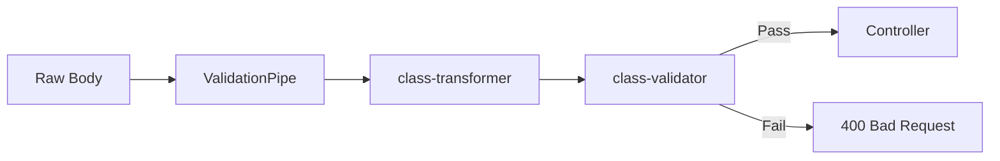

# Pipe Validation Deep Dive

Input validation and transformation using NestJS pipes.

## Global Validation Pipe

```typescript
// main.ts
app.useGlobalPipes(
  new ValidationPipe({
    whitelist: true, // Strip unknown properties
    forbidNonWhitelisted: true, // Throw on unknown properties
    transform: true, // Auto-transform payloads to DTO instances
    transformOptions: {
      enableImplicitConversion: true,
    },
  }),
);
```

## Validation Flow



## Common Decorators

| Decorator            | Validation             |
| -------------------- | ---------------------- |
| `@IsString()`        | Must be string         |
| `@IsNotEmpty()`      | Cannot be empty        |
| `@IsEmail()`         | Valid email            |
| `@IsUUID('4')`       | Valid UUID v4          |
| `@IsEnum(MyEnum)`    | Must be enum member    |
| `@IsDateString()`    | ISO 8601 date string   |
| `@IsOptional()`      | Skip if undefined      |
| `@ValidateNested()`  | Validate nested object |
| `@Type(() => Class)` | Transform to class     |
| `@Transform(fn)`     | Custom transformation  |

## Custom Pipe

```typescript
@Injectable()
export class TenantOrganizationPipe implements PipeTransform {
  transform(value: any) {
    const tenantId = RequestContext.currentTenantId();
    return { ...value, tenantId };
  }
}
```

## UUID Parameter Pipe

```typescript
@Get(':id')
async findOne(@Param('id', new ParseUUIDPipe()) id: string) {
  return this.service.findOneByIdString(id);
}
```

## Related Pages

- [DTO Design Patterns](./dto-design-patterns) — DTOs
- [Request Lifecycle](./request-lifecycle) — request flow
- [Error Handling](./error-handling-architecture) — errors
