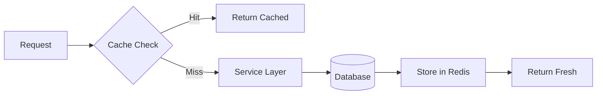

# Redis Caching Architecture

Caching strategy using Redis for performance optimization.

## Configuration

```env
REDIS_URL=redis://localhost:6379
REDIS_HOST=localhost
REDIS_PORT=6379
```

## Cache Layers



## NestJS Cache Integration

```typescript
import { CacheModule } from "@nestjs/cache-manager";
import * as redisStore from "cache-manager-redis-store";

@Module({
  imports: [
    CacheModule.register({
      store: redisStore,
      host: process.env.REDIS_HOST,
      port: process.env.REDIS_PORT,
      ttl: 300, // 5 minutes default
    }),
  ],
})
export class AppModule {}
```

## Using Cache

### Controller-Level

```typescript
@UseInterceptors(CacheInterceptor)
@CacheTTL(600)
@Get()
async findAll() {
  return this.employeeService.findAll();
}
```

### Service-Level

```typescript
@Injectable()
export class EmployeeService {
  constructor(@Inject(CACHE_MANAGER) private cache: Cache) {}

  async findById(id: string): Promise<Employee> {
    const cacheKey = `employee:${id}`;
    let employee = await this.cache.get<Employee>(cacheKey);

    if (!employee) {
      employee = await this.repository.findOne({ where: { id } });
      await this.cache.set(cacheKey, employee, 600);
    }

    return employee;
  }
}
```

## Cache Invalidation

```typescript
// Invalidate on update
async update(id: string, dto: UpdateDTO): Promise<Employee> {
  const result = await this.repository.save({ id, ...dto });
  await this.cache.del(`employee:${id}`);
  await this.cache.del('employee:list');
  return result;
}
```

## Cache Key Patterns

| Pattern                  | TTL   | Invalidation           |
| ------------------------ | ----- | ---------------------- |
| `employee:{id}`          | 10min | On update/delete       |
| `employee:list:{orgId}`  | 5min  | On any employee change |
| `task:count:{projectId}` | 2min  | On task change         |
| `permission:{userId}`    | 30min | On role change         |
| `config:{tenantId}`      | 60min | On config change       |

## Related Pages

- [Session Management](./session-management) — sessions
- [Background Jobs](./background-jobs) — async processing
- [Performance Benchmarks](../reference/performance-benchmarks) — performance
