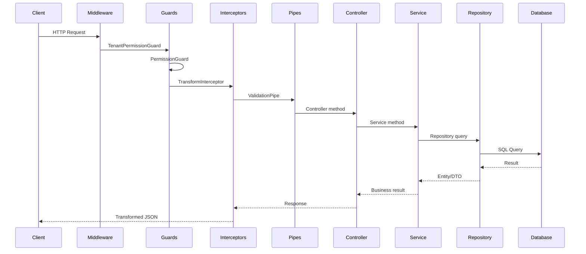
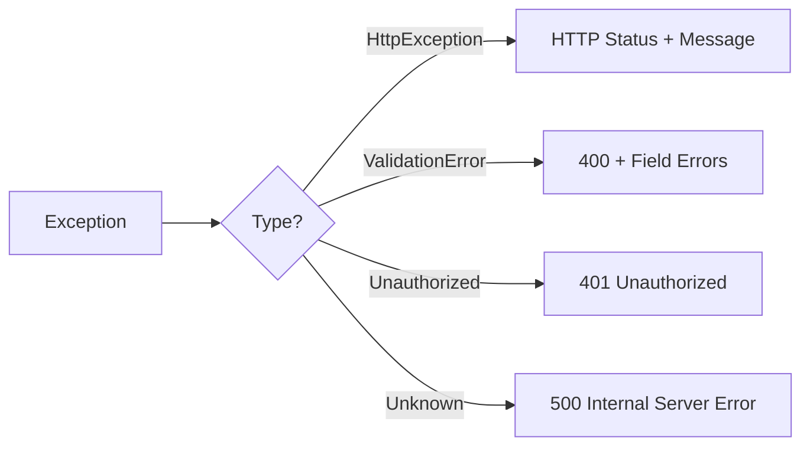

# Request Lifecycle

Understand how an HTTP request flows through the Ever Gauzy API from entry to response.

## Overview

## Phase 1: Middleware

Express middleware processes the raw request:

| Middleware      | Purpose              |
| --------------- | -------------------- |
| `helmet`        | Security headers     |
| `cors`          | CORS handling        |
| `compression`   | Response compression |
| `body-parser`   | JSON body parsing    |
| `cookie-parser` | Cookie parsing       |

## Phase 2: Guards

Guards determine if the request is authorized:

| Guard                   | Order | Purpose                     |
| ----------------------- | ----- | --------------------------- |
| `TenantPermissionGuard` | 1st   | Extract and validate tenant |
| `PermissionGuard`       | 2nd   | Check user permissions      |
| `RoleGuard`             | 3rd   | Check user role (optional)  |
| `FeatureFlagGuard`      | 4th   | Check feature availability  |

## Phase 3: Interceptors

Interceptors transform request/response:

| Interceptor            | Purpose                     |
| ---------------------- | --------------------------- |
| `TransformInterceptor` | Standardize response format |
| `TimeoutInterceptor`   | Request timeout handling    |
| `LazyLoadInterceptor`  | Lazy-load relations         |

## Phase 4: Pipes

Pipes validate and transform input:

| Pipe                 | Purpose                   |
| -------------------- | ------------------------- |
| `ValidationPipe`     | DTO class-validator       |
| `UUIDValidationPipe` | UUID parameter validation |
| `ParseJsonPipe`      | JSON query param parsing  |

## Phase 5: Controller → Service → Repository

The actual business logic execution:

1. **Controller** — route handler, delegates to service
2. **Service** — business logic, tenant filtering
3. **Repository** — database operations (TypeORM/MikroORM)

## Phase 6: Response

The response flows back through interceptors for transformation before being sent to the client.

## Error Handling

Errors at any phase are caught by the global exception filter:

## Related Pages

- [Guard & Interceptor Chain](./guard-interceptor-chain) — detailed guard docs
- [Error Handling Architecture](./error-handling-architecture) — error patterns
- [Backend Architecture](./backend-architecture) — system overview
