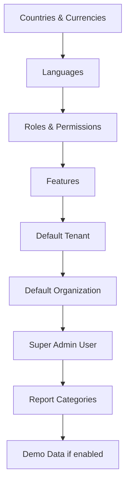

# Seed Data Architecture

How Gauzy seeds initial data for demo, testing, and production environments.

## Overview

Gauzy seeds the database on first launch with essential reference data:

- Countries and currencies
- Languages
- Default roles and permissions
- Feature definitions
- Report categories
- Organization settings

## Seed Types

| Type       | When Used     | Description                            |
| ---------- | ------------- | -------------------------------------- |
| Default    | Always        | Essential reference data               |
| Demo       | Demo/dev mode | Sample organizations, employees, tasks |
| Random     | Testing       | Random generated test data             |
| Production | First deploy  | Minimal bootstrap data                 |

## Seed Configuration

Controlled via environment variables:

| Variable         | Values           | Default |
| ---------------- | ---------------- | ------- |
| `DEMO`           | `true` / `false` | `false` |
| `SEED_DEMO_DATA` | `true` / `false` | `false` |

## Seed Order

Seeds execute in dependency order:



## Creating Custom Seeds

```typescript
export class MySeed implements ISeedModule {
  async createDefault(dataSource: DataSource): Promise<void> {
    // Seed default data
  }

  async createRandom(
    dataSource: DataSource,
    tenants: ITenant[],
  ): Promise<void> {
    // Seed random/demo data
  }
}
```

## Related Pages

- [Production Deployment](../devops/production-deployment) — deployment guide
- [Database Migration Guide](./database-migration-guide) — schema migrations
