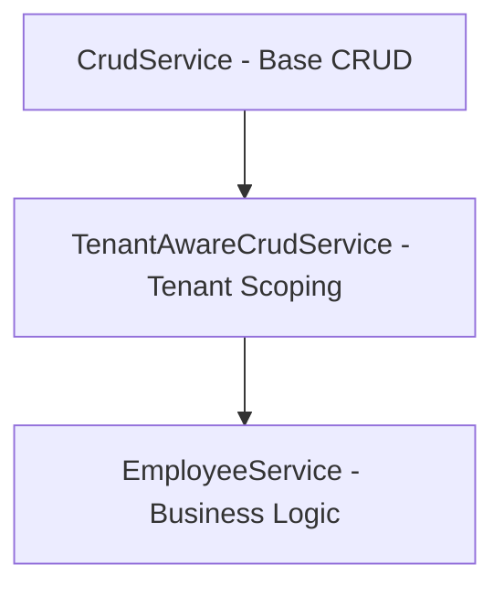

# Service Layer Patterns

Architecture and patterns for the Gauzy service layer.

## Base Service

All services extend `TenantAwareCrudService`, which provides:

- Automatic tenant scoping
- Standard CRUD operations
- Pagination support

```typescript
@Injectable()
export class EmployeeService extends TenantAwareCrudService<Employee> {
  constructor(
    @InjectRepository(Employee)
    private readonly employeeRepo: Repository<Employee>,
  ) {
    super(employeeRepo);
  }

  // Custom methods
  async findActiveByOrg(orgId: string): Promise<Employee[]> {
    return this.repository.find({
      where: {
        organizationId: orgId,
        isActive: true,
        tenantId: RequestContext.currentTenantId(),
      },
    });
  }
}
```

## Service Hierarchy



## Common Patterns

### Factory Pattern

```typescript
async create(dto: CreateDTO): Promise<Entity> {
  const entity = this.repository.create(dto);
  entity.tenantId = RequestContext.currentTenantId();
  return this.repository.save(entity);
}
```

### Decorator Pattern

```typescript
@PermissionGuard(PermissionsEnum.EMPLOYEES_EDIT)
async update(id: string, dto: UpdateDTO): Promise<Entity> {
  return super.update(id, dto);
}
```

### Strategy Pattern (Multi-ORM)

```typescript
const strategy =
  this.configService.get("DB_ORM") === "mikroorm"
    ? new MikroOrmStrategy()
    : new TypeOrmStrategy();
```

## Related Pages

- [Repository Pattern](./repository-pattern) — data access
- [Request Lifecycle](./request-lifecycle) — request flow
- [CQRS Pattern](./cqrs-pattern) — CQRS
