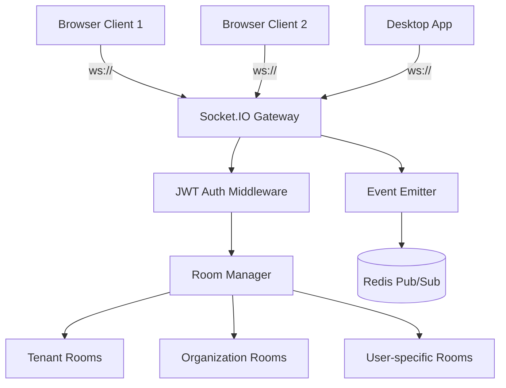

# WebSocket Architecture

Real-time communication using WebSockets.

## Overview

Gauzy uses **Socket.IO** over WebSockets for real-time features:

- Live timer updates
- Team presence (online/offline)
- Notification push
- Task status changes
- Dashboard refresh

## Architecture



## Gateway Implementation

```typescript
@WebSocketGateway({
  cors: { origin: "*" },
  namespace: "/notifications",
})
export class NotificationGateway
  implements OnGatewayConnection, OnGatewayDisconnect
{
  @WebSocketServer()
  server: Server;

  async handleConnection(client: Socket) {
    const user = await this.authenticate(client);
    client.join(`tenant:${user.tenantId}`);
    client.join(`user:${user.id}`);
  }

  handleDisconnect(client: Socket) {
    // Update presence
  }

  @SubscribeMessage("timer:start")
  handleTimerStart(client: Socket, data: any) {
    this.server.to(`tenant:${data.tenantId}`).emit("timer:updated", data);
  }
}
```

## Room Structure

| Room Pattern          | Scope              |
| --------------------- | ------------------ |
| `tenant:{tenantId}`   | All tenant users   |
| `org:{orgId}`         | Organization users |
| `user:{userId}`       | Single user        |
| `project:{projectId}` | Project members    |

## Scaling with Redis Adapter

```typescript
import { createAdapter } from "@socket.io/redis-adapter";

const pubClient = createClient({ url: process.env.REDIS_URL });
const subClient = pubClient.duplicate();

io.adapter(createAdapter(pubClient, subClient));
```

## Related Pages

- [Real-Time Notifications](./real-time-notifications) — notification events
- [Live Timer Updates](./live-timer-updates) — timer sync
- [Presence & Online Status](./presence-status) — user presence
