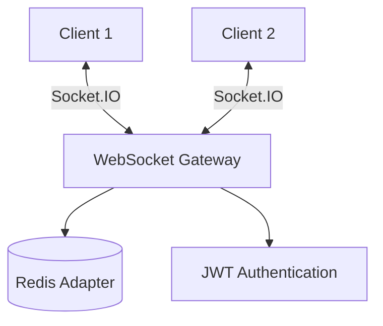

# WebSocket & Real-Time Architecture

Real-time communication using Socket.IO for live updates and notifications.

## Overview

Gauzy uses Socket.IO for real-time features:

- Live time tracker status updates
- Instant notifications
- Real-time dashboard data
- Team activity feeds

## Architecture



## Gateway Setup

```typescript
@WebSocketGateway({
  cors: { origin: "*" },
  namespace: "/ws",
})
export class NotificationGateway implements OnGatewayConnection {
  @WebSocketServer()
  server: Server;

  handleConnection(client: Socket) {
    const user = this.validateToken(client.handshake.auth.token);
    client.join(`tenant:${user.tenantId}`);
  }

  @SubscribeMessage("start-timer")
  handleStartTimer(client: Socket, data: any) {
    this.server.to(`tenant:${data.tenantId}`).emit("timer-started", data);
  }
}
```

## Events

| Event              | Direction       | Description              |
| ------------------ | --------------- | ------------------------ |
| `timer-started`    | Server → Client | Employee started timer   |
| `timer-stopped`    | Server → Client | Employee stopped timer   |
| `screenshot-taken` | Server → Client | New screenshot available |
| `notification`     | Server → Client | New notification         |
| `task-updated`     | Server → Client | Task status changed      |

## Redis Adapter (Multi-Instance)

For multi-server deployments, WebSocket events are broadcast through Redis:

```typescript
import { createAdapter } from "@socket.io/redis-adapter";

const pubClient = new Redis(config.redis);
const subClient = pubClient.duplicate();
server.adapter(createAdapter(pubClient, subClient));
```

## Client Connection

```typescript
import { io } from "socket.io-client";

const socket = io("wss://api.example.com/ws", {
  auth: { token: "jwt-token" },
});

socket.on("notification", (data) => {
  console.log("New notification:", data);
});
```

## Related Pages

- [Scaling & High Availability](../devops/scaling) — multi-instance WebSocket
- [Redis & Caching](../advanced/redis-and-caching) — Redis infrastructure
- [Employee Notifications](../features/employee-notifications) — notifications
