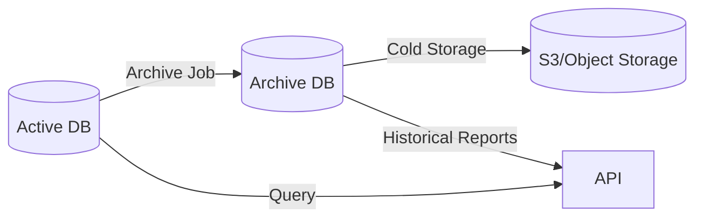

# Data Archival

Strategies for archiving old data to maintain performance.

## When to Archive

| Data Type       | Archive After | Reason                |
| --------------- | ------------- | --------------------- |
| Screenshots     | 90 days       | Storage cost          |
| Time logs       | 2 years       | Performance           |
| Activity logs   | 1 year        | Storage & performance |
| Audit logs      | 3 years       | Compliance            |
| Deleted records | 90 days       | GDPR compliance       |

## Archive Strategy



## Implementation

### Automated Archival Job

```typescript
@Cron(CronExpression.EVERY_1ST_DAY_OF_MONTH_AT_MIDNIGHT)
async archiveOldScreenshots() {
  const cutoff = subDays(new Date(), 90);

  // Move to archive storage
  const old = await this.screenshotRepo.find({
    where: { createdAt: LessThan(cutoff) },
  });

  for (const screenshot of old) {
    await this.archiveStorage.store(screenshot);
    await this.screenshotRepo.softDelete(screenshot.id);
  }
}
```

### Table Partitioning

```sql
-- Partition time_log by month
CREATE TABLE time_log (
    id UUID PRIMARY KEY,
    started_at TIMESTAMPTZ NOT NULL,
    employee_id UUID NOT NULL
) PARTITION BY RANGE (started_at);

CREATE TABLE time_log_2025_03 PARTITION OF time_log
    FOR VALUES FROM ('2025-03-01') TO ('2025-04-01');
```

## Related Pages

- [Soft Delete](./soft-delete) — soft delete patterns
- [Database Schema](./schema-overview) — schema
- [GDPR Compliance](../security/compliance-gdpr) — data retention
