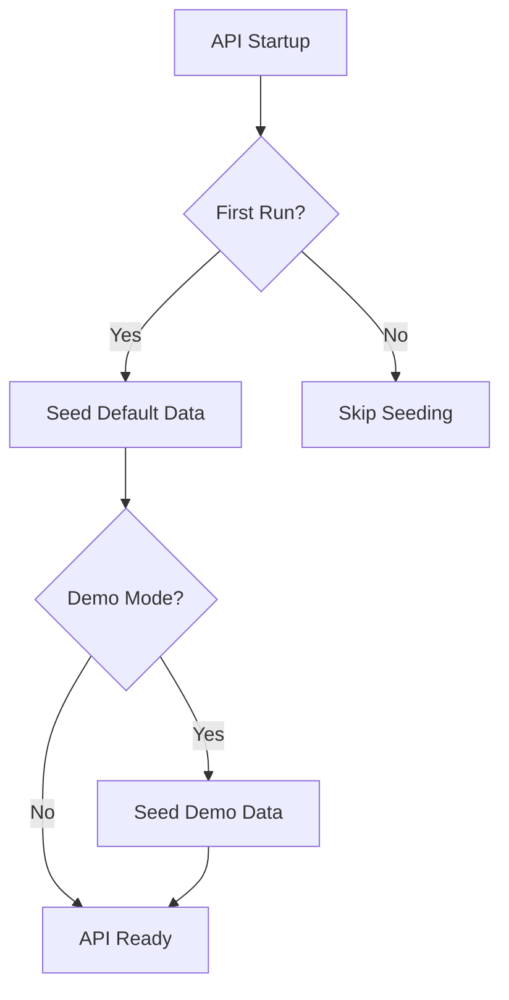

# Database Seeding

Seed the database with initial and demo data.

## Overview

Gauzy seeds data automatically on first startup. The seeding system supports:

- **Default data** — required for the system to function (roles, permissions, languages)
- **Demo data** — example organization, employees, and activities for testing

## Seed Architecture



## Configuration

```env
# Enable demo data seeding
DEMO=true

# Seed on startup
IS_SEED=true
```

## Default Seed Data

| Entity          | Data                         |
| --------------- | ---------------------------- |
| Languages       | 30+ languages                |
| Countries       | All countries                |
| Currencies      | Major currencies             |
| Roles           | SUPER_ADMIN, ADMIN, EMPLOYEE |
| Permissions     | All permission definitions   |
| Feature Toggles | Default feature settings     |

## Demo Seed Data

| Entity       | Data                  |
| ------------ | --------------------- |
| Tenant       | "Ever Technologies"   |
| Organization | Demo organization     |
| Admin User   | admin@ever.co / admin |
| Employees    | 10+ demo employees    |
| Projects     | Sample projects       |
| Tasks        | Sample tasks          |
| Time Logs    | Demo time entries     |

## Custom Seeding

```typescript
// Create a custom seeder
export class CustomSeeder {
  async run(dataSource: DataSource): Promise<void> {
    const repo = dataSource.getRepository(MyEntity);
    await repo.save([{ name: "Item 1" }, { name: "Item 2" }]);
  }
}
```

## Running Seeds Manually

```bash
# Run all seeds
yarn seed:all

# Run only default seeds
yarn seed:default

# Run only demo seeds
yarn seed:demo
```

## Related Pages

- [Database Schema](./schema-overview) — schema
- [Getting Started](../tutorials/getting-started-tutorial) — setup tutorial
- [Test Fixtures](../testing/test-fixtures) — test data
