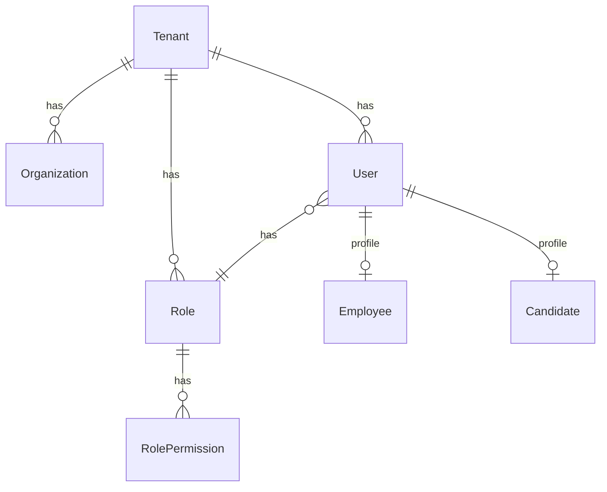

# Core Entities

Core platform entities: User, Tenant, Organization, Role, and RolePermission.

## User

The `User` entity represents an authenticated account. Each user belongs to one tenant and can be associated with an employee or candidate profile.

| Column                     | Type    | Description                          |
| -------------------------- | ------- | ------------------------------------ |
| `id`                       | UUID    | Primary key                          |
| `email`                    | string  | Unique email address                 |
| `firstName`                | string? | First name                           |
| `lastName`                 | string? | Last name                            |
| `hash`                     | string? | Password hash (bcrypt)               |
| `imageUrl`                 | string? | Avatar URL                           |
| `preferredLanguage`        | string? | i18n preference (e.g., `en`)         |
| `preferredComponentLayout` | enum?   | `TABLE`, `CARDS_GRID`, `SPRINT_VIEW` |
| `thirdPartyId`             | string? | OAuth provider ID                    |
| `roleId`                   | UUID?   | FK to `role`                         |
| `tenantId`                 | UUID?   | FK to `tenant`                       |

**Relations:**

| Relation         | Type       | Target        | Description       |
| ---------------- | ---------- | ------------- | ----------------- |
| `role`           | ManyToOne  | Role          | User's role       |
| `tenant`         | ManyToOne  | Tenant        | User's tenant     |
| `employee`       | OneToOne   | Employee      | Employee profile  |
| `candidate`      | OneToOne   | Candidate     | Candidate profile |
| `tags`           | ManyToMany | Tag           | Associated tags   |
| `socialAccounts` | OneToMany  | SocialAccount | OAuth providers   |

## Tenant

The `Tenant` entity is the top-level isolation boundary. All data is scoped to a tenant.

| Column | Type    | Description |
| ------ | ------- | ----------- |
| `id`   | UUID    | Primary key |
| `name` | string  | Tenant name |
| `logo` | string? | Logo URL    |

**Relations:**

| Relation        | Type      | Target        |
| --------------- | --------- | ------------- |
| `organizations` | OneToMany | Organization  |
| `users`         | OneToMany | User          |
| `roles`         | OneToMany | Role          |
| `settings`      | OneToMany | TenantSetting |
| `apiKeys`       | OneToMany | TenantApiKey  |

## Organization

The `Organization` entity represents a business unit within a tenant.

| Column                 | Type     | Description                     |
| ---------------------- | -------- | ------------------------------- |
| `id`                   | UUID     | Primary key                     |
| `name`                 | string   | Organization name               |
| `officialName`         | string?  | Legal/official name             |
| `currency`             | enum     | Default currency                |
| `defaultValueDateType` | enum     | Date type for budgets           |
| `regionCode`           | string?  | Region code                     |
| `imageUrl`             | string?  | Organization image              |
| `isDefault`            | boolean  | Default organization flag       |
| `totalEmployees`       | number?  | Total employee count            |
| `profile_link`         | string?  | Public profile URL slug         |
| `banner`               | string?  | Banner image URL                |
| `invitesAllowed`       | boolean? | Whether invitations are allowed |
| `bonusType`            | enum?    | Bonus calculation type          |
| `bonusPercentage`      | number?  | Bonus percentage                |
| `fiscalStartDate`      | Date?    | Fiscal year start               |
| `fiscalEndDate`        | Date?    | Fiscal year end                 |
| `futureDateAllowed`    | boolean? | Allow future date entries       |

## Role

| Column     | Type    | Description                |
| ---------- | ------- | -------------------------- |
| `id`       | UUID    | Primary key                |
| `name`     | string  | Role name (e.g., `ADMIN`)  |
| `isSystem` | boolean | System-defined (immutable) |
| `tenantId` | UUID    | FK to tenant               |

**Built-in Roles:** `SUPER_ADMIN`, `ADMIN`, `DATA_ENTRY`, `EMPLOYEE`, `CANDIDATE`, `MANAGER`, `VIEWER`

## RolePermission

| Column       | Type    | Description           |
| ------------ | ------- | --------------------- |
| `id`         | UUID    | Primary key           |
| `roleId`     | UUID    | FK to role            |
| `permission` | string  | Permission enum value |
| `enabled`    | boolean | Whether enabled       |
| `tenantId`   | UUID    | FK to tenant          |

## Entity Relationship Diagram

## Related Pages

- [Tenant Endpoints](../../api/tenant-endpoints) — API reference
- [User Endpoints](../../api/user-endpoints) — user API
- [Role & Permission Endpoints](../../api/role-permission-endpoints) — roles API
