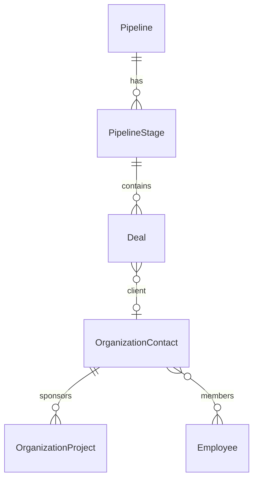

# CRM Entities

Entities for contacts, sales pipelines, pipeline stages, and deals.

## Contact (OrganizationContact)

| Column         | Type    | Description                                       |
| -------------- | ------- | ------------------------------------------------- |
| `name`         | string  | Contact/company name                              |
| `contactType`  | enum    | `CUSTOMER`, `CLIENT`, `LEAD`, `VENDOR`, `PARTNER` |
| `primaryEmail` | string? | Primary email                                     |
| `primaryPhone` | string? | Primary phone                                     |
| `imageUrl`     | string? | Avatar/logo                                       |
| `budget`       | number? | Client budget                                     |
| `budgetType`   | enum?   | `HOURS` or `COST`                                 |
| `notes`        | string? | Notes                                             |

**Relations:** `members` (ManyToMany Employee), `projects` (OneToMany OrganizationProject), `invoices` (ManyToMany Invoice), `tags` (ManyToMany Tag)

## Pipeline

| Column        | Type    | Description   |
| ------------- | ------- | ------------- |
| `name`        | string  | Pipeline name |
| `description` | string? | Description   |
| `isActive`    | boolean | Active status |

**Relations:** `stages` (OneToMany PipelineStage)

## PipelineStage

| Column        | Type    | Description    |
| ------------- | ------- | -------------- |
| `name`        | string  | Stage name     |
| `description` | string? | Description    |
| `index`       | number  | Order index    |
| `pipelineId`  | UUID    | FK to pipeline |

**Relations:** `deals` (OneToMany Deal)

## Deal

| Column            | Type    | Description             |
| ----------------- | ------- | ----------------------- |
| `title`           | string  | Deal title              |
| `probability`     | number? | Win probability (0-100) |
| `stageId`         | UUID    | FK to pipeline stage    |
| `clientId`        | UUID?   | FK to contact           |
| `createdByUserId` | UUID?   | FK to creator           |

**Relations:** `stage` (ManyToOne PipelineStage), `client` (ManyToOne OrganizationContact)

## Entity Relationships

## Related Pages

- [Pipeline & Deal Endpoints](../../api/pipeline-deal-endpoints) — API reference
- [Contact Endpoints](../../api/contact-endpoints) — contact API
- [Sales Pipelines](../../features/sales-pipelines) — feature guide
