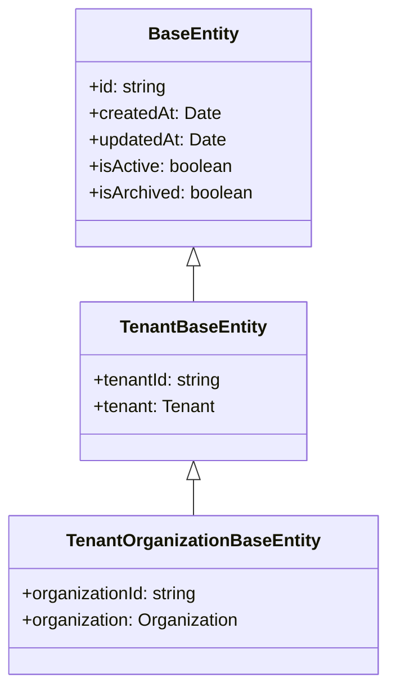

# Entity Reference Overview

This section documents all database entities in the Ever Gauzy platform. Entities are organized by domain and include field definitions, relationships, and inheritance hierarchy.

## Entity Inheritance

All entities inherit from a base hierarchy:



Most entities extend `TenantOrganizationBaseEntity`, inheriting automatic tenant and organization scoping.

## Entity Index by Domain

### Core

| Entity                                           | Table             | Description            |
| ------------------------------------------------ | ----------------- | ---------------------- |
| [User](./core-entities#user)                     | `user`            | User accounts          |
| [Tenant](./core-entities#tenant)                 | `tenant`          | Top-level isolation    |
| [Organization](./core-entities#organization)     | `organization`    | Business units         |
| [Role](./core-entities#role)                     | `role`            | User roles             |
| [RolePermission](./core-entities#rolepermission) | `role_permission` | Permission assignments |

### Employees

| Entity                                                 | Table              | Description            |
| ------------------------------------------------------ | ------------------ | ---------------------- |
| [Employee](./employee-entities#employee)               | `employee`         | Employee records       |
| [EmployeeAward](./employee-entities#employeeaward)     | `employee_award`   | Awards and recognition |
| [EmployeeLevel](./employee-entities#employeelevel)     | `employee_level`   | Seniority levels       |
| [EmployeeSetting](./employee-entities#employeesetting) | `employee_setting` | Per-employee settings  |

### Time Tracking

| Entity                                            | Table        | Description           |
| ------------------------------------------------- | ------------ | --------------------- |
| [TimeLog](./time-tracking-entities#timelog)       | `time_log`   | Time entries          |
| [TimeSlot](./time-tracking-entities#timeslot)     | `time_slot`  | 10-min activity slots |
| [Timesheet](./time-tracking-entities#timesheet)   | `timesheet`  | Weekly timesheets     |
| [Screenshot](./time-tracking-entities#screenshot) | `screenshot` | Activity screenshots  |
| [Activity](./time-tracking-entities#activity)     | `activity`   | App/URL activities    |

### Tasks & Projects

| Entity                                                             | Table                  | Description      |
| ------------------------------------------------------------------ | ---------------------- | ---------------- |
| [Task](./task-project-entities#task)                               | `task`                 | Work items       |
| [OrganizationProject](./task-project-entities#organizationproject) | `organization_project` | Projects         |
| [OrganizationSprint](./task-project-entities#organizationsprint)   | `organization_sprint`  | Agile sprints    |
| [DailyPlan](./task-project-entities#dailyplan)                     | `daily_plan`           | Daily work plans |

### Financial

| Entity                                                | Table          | Description            |
| ----------------------------------------------------- | -------------- | ---------------------- |
| [Invoice](./invoice-payment-entities#invoice)         | `invoice`      | Invoices and estimates |
| [InvoiceItem](./invoice-payment-entities#invoiceitem) | `invoice_item` | Line items             |
| [Payment](./invoice-payment-entities#payment)         | `payment`      | Payment records        |
| [Expense](./expense-income-entities#expense)          | `expense`      | Business expenses      |
| [Income](./expense-income-entities#income)            | `income`       | Revenue entries        |

### CRM & ATS

| Entity                            | Table                  | Description       |
| --------------------------------- | ---------------------- | ----------------- |
| [Contact](./crm-entities)         | `organization_contact` | Business contacts |
| [Pipeline](./crm-entities)        | `pipeline`             | Sales pipelines   |
| [Deal](./crm-entities)            | `deal`                 | Sales deals       |
| [Candidate](./candidate-entities) | `candidate`            | Job candidates    |

### Products & Inventory

| Entity                                         | Table             | Description      |
| ---------------------------------------------- | ----------------- | ---------------- |
| [Product](./product-inventory-entities)        | `product`         | Products         |
| [ProductVariant](./product-inventory-entities) | `product_variant` | Product variants |
| [Warehouse](./product-inventory-entities)      | `warehouse`       | Warehouses       |

### Collaboration

| Entity                               | Table      | Description          |
| ------------------------------------ | ---------- | -------------------- |
| [Comment](./collaboration-entities)  | `comment`  | Comments on entities |
| [Mention](./collaboration-entities)  | `mention`  | @mentions            |
| [Reaction](./collaboration-entities) | `reaction` | Emoji reactions      |
| [Favorite](./collaboration-entities) | `favorite` | Bookmarked entities  |

## Multi-ORM Support

All entities are decorated for both TypeORM and MikroORM using the `MultiORMEntity` decorator:

```typescript
@MultiORMEntity("table_name")
export class MyEntity extends TenantOrganizationBaseEntity {
  @MultiORMColumn()
  name: string;
}
```

See [Multi-ORM Architecture](../../architecture/multi-orm-architecture) and [Multi-ORM Entities](../multi-orm-entities) for details.
