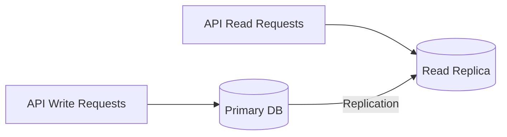

# Read Replicas

Configure read replicas for database scaling.

## Overview

Read replicas offload read queries from the primary database, improving performance for read-heavy workloads.



## PostgreSQL Streaming Replication

### Primary Configuration

```ini
# postgresql.conf
wal_level = replica
max_wal_senders = 5
wal_keep_size = '1GB'
```

### Replica Configuration

```bash
# Create replica from primary
pg_basebackup -h primary-host -D /var/lib/postgresql/data -U replication -P

# recovery.conf (or standby.signal in PG12+)
primary_conninfo = 'host=primary-host port=5432 user=replication password=secret'
```

## TypeORM Configuration

```typescript
// ormconfig.ts
{
  type: 'postgres',
  replication: {
    master: {
      host: process.env.DB_HOST,
      port: 5432,
      username: process.env.DB_USER,
      password: process.env.DB_PASS,
      database: process.env.DB_NAME,
    },
    slaves: [
      {
        host: process.env.DB_REPLICA_HOST,
        port: 5432,
        username: process.env.DB_USER,
        password: process.env.DB_PASS,
        database: process.env.DB_NAME,
      },
    ],
  },
}
```

## Query Routing

TypeORM automatically routes:

- **Writes** (INSERT, UPDATE, DELETE) → Primary
- **Reads** (SELECT) → Replicas (round-robin)

## Related Pages

- [Connection Pooling](./connection-pooling) — pool config
- [Indexing Strategy](./indexing-strategy) — query performance
- [Auto-Scaling](../devops/auto-scaling) — scaling
