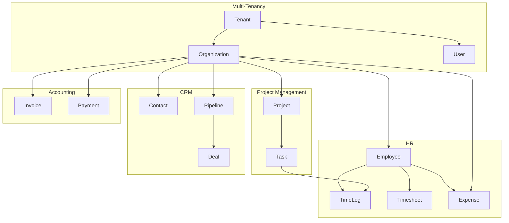

# Database Schema Overview

Comprehensive overview of the Ever Gauzy database schema.

## Core Entity Groups

## Key Tables

### Multi-Tenancy

| Table             | Description               | Relations              |
| ----------------- | ------------------------- | ---------------------- |
| `tenant`          | Top-level isolation       | Has many organizations |
| `organization`    | Business entity           | Belongs to tenant      |
| `user`            | Authentication entity     | Belongs to tenant      |
| `role`            | Permission group          | Belongs to tenant      |
| `role_permission` | Role ↔ permission mapping | Belongs to role        |

### Employees & HR

| Table        | Description             | Relations            |
| ------------ | ----------------------- | -------------------- |
| `employee`   | Employee profile        | Belongs to user      |
| `time_log`   | Individual time entries | Belongs to employee  |
| `timesheet`  | Weekly time summary     | Has many time_logs   |
| `time_slot`  | Activity time slots     | Belongs to time_log  |
| `screenshot` | Screen captures         | Belongs to time_slot |
| `activity`   | Keyboard/mouse activity | Belongs to time_slot |
| `expense`    | Expense records         | Belongs to employee  |
| `income`     | Income records          | Belongs to employee  |

### Project Management

| Table        | Description            | Relations           |
| ------------ | ---------------------- | ------------------- |
| `project`    | Project entity         | Belongs to org      |
| `task`       | Work items             | Belongs to project  |
| `sprint`     | Sprint iterations      | Belongs to project  |
| `daily_plan` | Daily work plans       | Belongs to employee |
| `goal`       | OKR objectives         | Belongs to org      |
| `goal_kpi`   | Key performance metric | Belongs to goal     |

### Accounting

| Table          | Description      | Relations          |
| -------------- | ---------------- | ------------------ |
| `invoice`      | Invoice entity   | Has many items     |
| `invoice_item` | Line items       | Belongs to invoice |
| `payment`      | Payment records  | Belongs to invoice |
| `estimate`     | Quotes/estimates | Has many items     |

### CRM

| Table      | Description        | Relations           |
| ---------- | ------------------ | ------------------- |
| `contact`  | Client/lead entity | Belongs to org      |
| `pipeline` | Sales pipeline     | Has many stages     |
| `deal`     | Sales opportunity  | Belongs to pipeline |

## Common Columns

All entities inherit from `TenantOrganizationBaseEntity`:

| Column           | Type      | Description        |
| ---------------- | --------- | ------------------ |
| `id`             | UUID      | Primary key        |
| `tenantId`       | UUID      | Tenant scope       |
| `organizationId` | UUID      | Organization scope |
| `createdAt`      | timestamp | Creation timestamp |
| `updatedAt`      | timestamp | Last update        |
| `isActive`       | boolean   | Soft active flag   |
| `isArchived`     | boolean   | Archive flag       |

## Related Pages

- [Entity Inheritance](../architecture/entity-inheritance) — base entities
- [Multi-Tenant Data Flow](../architecture/multi-tenant-data-flow) — tenant scoping
- [TypeORM Migrations](./typeorm-migrations) — schema changes
