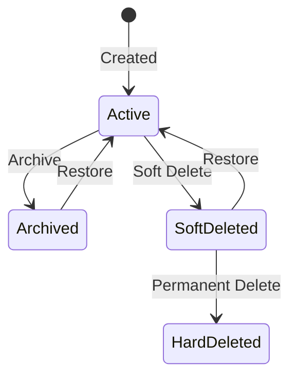

# Soft Delete Patterns

How Gauzy implements soft deletes to preserve data integrity.

## Overview

Instead of permanently deleting records, Gauzy marks them as inactive/archived:

```typescript
@MultiORMEntity("employee")
export class Employee extends TenantOrganizationBaseEntity {
  @MultiORMColumn({ default: true })
  isActive: boolean;

  @MultiORMColumn({ default: false })
  isArchived: boolean;

  @DeleteDateColumn()
  deletedAt?: Date;
}
```

## Soft Delete Behavior



## Implementation

### Service Layer

```typescript
// Soft delete - sets deletedAt timestamp
async softDelete(id: string): Promise<void> {
  await this.repository.softDelete(id);
}

// Restore soft-deleted entity
async restore(id: string): Promise<void> {
  await this.repository.restore(id);
}

// Hard delete (permanent)
async hardDelete(id: string): Promise<void> {
  await this.repository.delete(id);
}
```

### Querying (Excluding Deleted)

TypeORM's `@DeleteDateColumn` automatically filters soft-deleted records:

```typescript
// This automatically excludes soft-deleted records
const employees = await this.repository.find();

// To include soft-deleted records
const all = await this.repository.find({ withDeleted: true });

// To find only soft-deleted records
const deleted = await this.repository
  .createQueryBuilder("e")
  .withDeleted()
  .where("e.deletedAt IS NOT NULL")
  .getMany();
```

## Related Pages

- [Database Schema](./schema-overview) — schema overview
- [Entity Inheritance](../architecture/entity-inheritance) — base entity
- [Bulk Operations](../features/bulk-operations) — bulk delete
