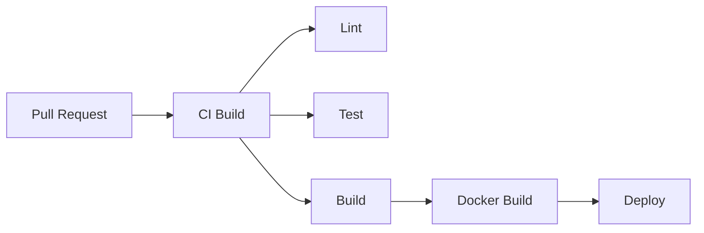

# CI/CD Pipeline Guide

Continuous integration and deployment pipeline configuration.

## Overview

Gauzy uses GitHub Actions for CI/CD with the following stages:



## CI Pipeline (Pull Requests)

Triggered on every PR:

```yaml
name: CI
on:
  pull_request:
    branches: [develop, main]

jobs:
  build:
    runs-on: ubuntu-latest
    steps:
      - uses: actions/checkout@v4
      - uses: actions/setup-node@v6
        with:
          node-version: 20
      - run: yarn install --frozen-lockfile
      - run: yarn lint
      - run: yarn test
      - run: yarn build
```

## CD Pipeline (Main Branch)

Triggered on merge to main:

1. **Build** Docker images
2. **Push** to GHCR (`ghcr.io/ever-co/gauzy-*`)
3. **Deploy** to staging/production

## Docker Build Pipeline

```yaml
- name: Build and push
  uses: docker/build-push-action@v5
  with:
    context: .
    push: true
    tags: ghcr.io/ever-co/gauzy-api:latest
    build-args: |
      VERDACCIO_TOKEN=${{ secrets.VERDACCIO_TOKEN }}
```

## Deployment Environments

| Environment | Trigger         | Target              |
| ----------- | --------------- | ------------------- |
| Dev         | Push to develop | dev.example.com     |
| Staging     | Push to main    | staging.example.com |
| Production  | Manual release  | app.example.com     |

## Required Secrets

| Secret                | Description             |
| --------------------- | ----------------------- |
| `GITHUB_TOKEN`        | Auto-provided by GH     |
| `VERDACCIO_TOKEN`     | Private registry token  |
| `DOCKER_HUB_USERNAME` | Container registry auth |
| `SENTRY_DSN`          | Error tracking          |
| `DEPLOY_KEY`          | SSH deploy key          |

## Related Pages

- [Production Deployment](../devops/production-deployment) — deploy guide
- [Private Registry](../devops/private-registry) — Verdaccio
- [Release Process](../development/release-process) — release workflow
