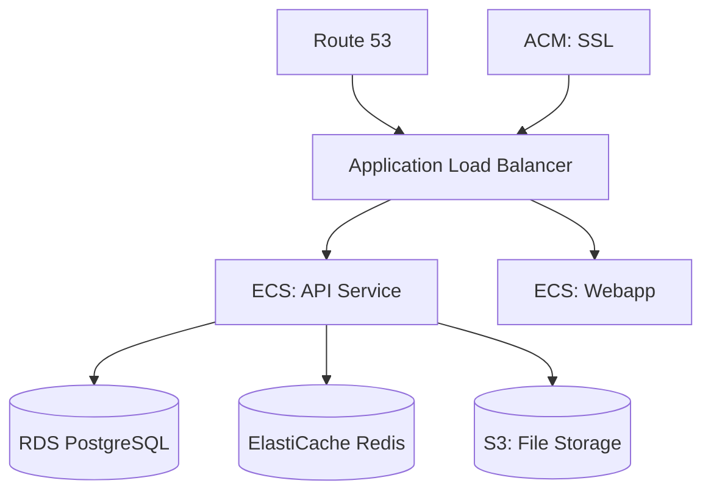

# AWS Deployment Guide

Deploy Ever Gauzy to Amazon Web Services (AWS).

## Architecture



## Services Used

| AWS Service     | Purpose                 |
| --------------- | ----------------------- |
| ECS (Fargate)   | Container orchestration |
| RDS             | PostgreSQL database     |
| ElastiCache     | Redis caching           |
| S3              | File storage            |
| ALB             | Load balancing          |
| Route 53        | DNS management          |
| ACM             | SSL certificates        |
| Secrets Manager | Secret storage          |
| CloudWatch      | Monitoring & logs       |

## Quick Start with ECS

### 1. Create RDS PostgreSQL

```bash
aws rds create-db-instance \
  --db-instance-identifier gauzy-db \
  --db-instance-class db.t3.medium \
  --engine postgres \
  --master-username gauzy \
  --master-user-password your-password \
  --allocated-storage 50
```

### 2. Create ElastiCache Redis

```bash
aws elasticache create-cache-cluster \
  --cache-cluster-id gauzy-redis \
  --engine redis \
  --cache-node-type cache.t3.micro \
  --num-cache-nodes 1
```

### 3. Create ECS Task Definition

```json
{
  "family": "gauzy-api",
  "containerDefinitions": [
    {
      "name": "api",
      "image": "ghcr.io/ever-co/gauzy-api:latest",
      "portMappings": [{ "containerPort": 3000 }],
      "environment": [
        { "name": "DB_TYPE", "value": "postgres" },
        { "name": "DB_HOST", "value": "gauzy-db.xxx.rds.amazonaws.com" },
        {
          "name": "REDIS_HOST",
          "value": "gauzy-redis.xxx.cache.amazonaws.com"
        },
        { "name": "FILE_PROVIDER", "value": "S3" },
        { "name": "AWS_S3_BUCKET", "value": "gauzy-uploads" }
      ]
    }
  ]
}
```

### 4. Configure S3 File Storage

```
FILE_PROVIDER=S3
AWS_ACCESS_KEY_ID=your-key
AWS_SECRET_ACCESS_KEY=your-secret
AWS_REGION=us-east-1
AWS_S3_BUCKET=gauzy-uploads
```

## Cost Estimate

| Service         | Size           | Monthly Cost |
| --------------- | -------------- | ------------ |
| ECS Fargate (2) | 1 vCPU, 2GB    | ~$60         |
| RDS             | db.t3.medium   | ~$70         |
| ElastiCache     | cache.t3.micro | ~$15         |
| S3              | 10GB           | ~$1          |
| ALB             | Standard       | ~$20         |
| **Total**       |                | **~$166/mo** |

## Related Pages

- [Production Deployment](../devops/production-deployment) — general guide
- [Environment Variables](../devops/environment-variables) — configuration
- [Scaling & HA](../devops/scaling) — scaling guide
