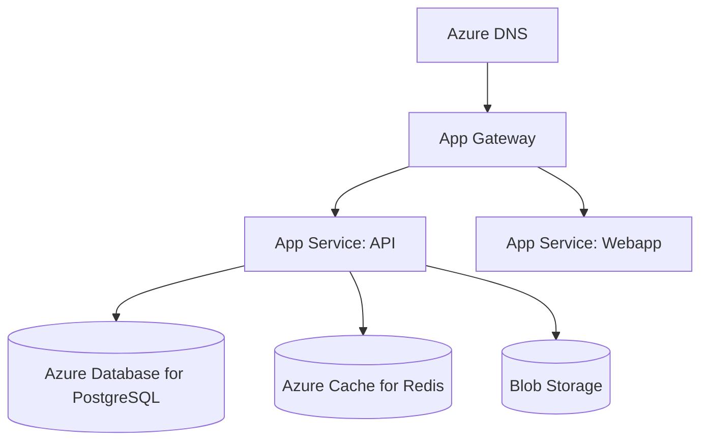

# Azure Deployment Guide

Deploy Ever Gauzy to Microsoft Azure.

## Architecture



## Services Used

| Azure Service         | Purpose             |
| --------------------- | ------------------- |
| App Service           | Container hosting   |
| Azure Database for PG | PostgreSQL          |
| Azure Cache for Redis | Redis               |
| Blob Storage          | File storage        |
| Application Gateway   | Load balancer + WAF |
| Azure DNS             | DNS management      |
| Key Vault             | Secret management   |
| Application Insights  | Monitoring          |

## Quick Start

### 1. Create Resources

```bash
# Create resource group
az group create --name gauzy-rg --location eastus

# Create PostgreSQL
az postgres flexible-server create \
  --name gauzy-db \
  --resource-group gauzy-rg \
  --admin-user gauzy \
  --admin-password your-password \
  --sku-name Standard_B1ms

# Create Redis
az redis create \
  --name gauzy-redis \
  --resource-group gauzy-rg \
  --sku Basic \
  --vm-size c0

# Create App Service
az webapp create \
  --name gauzy-api \
  --resource-group gauzy-rg \
  --plan gauzy-plan \
  --deployment-container-image-name ghcr.io/ever-co/gauzy-api:latest
```

### 2. Configure Environment

```bash
az webapp config appsettings set \
  --name gauzy-api \
  --resource-group gauzy-rg \
  --settings \
    DB_TYPE=postgres \
    DB_HOST=gauzy-db.postgres.database.azure.com \
    REDIS_HOST=gauzy-redis.redis.cache.windows.net
```

## Related Pages

- [Production Deployment](../devops/production-deployment) — general guide
- [GCP Deployment](./gcp-deployment) — Google Cloud alternative
