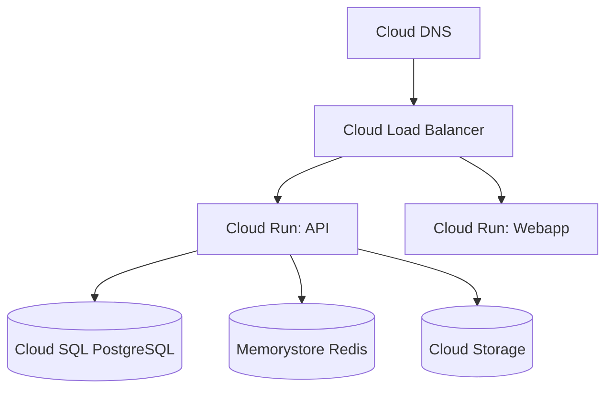

# GCP Deployment Guide

Deploy Ever Gauzy to Google Cloud Platform.

## Architecture



## Services Used

| GCP Service         | Purpose           |
| ------------------- | ----------------- |
| Cloud Run           | Container hosting |
| Cloud SQL           | PostgreSQL        |
| Memorystore         | Redis             |
| Cloud Storage       | File storage      |
| Cloud Load Balancer | Load balancing    |
| Secret Manager      | Secrets           |
| Cloud Monitoring    | Monitoring        |

## Quick Start

```bash
# Deploy API to Cloud Run
gcloud run deploy gauzy-api \
  --image ghcr.io/ever-co/gauzy-api:latest \
  --platform managed \
  --region us-central1 \
  --set-env-vars DB_TYPE=postgres,DB_HOST=/cloudsql/project:region:instance \
  --add-cloudsql-instances project:region:instance \
  --allow-unauthenticated
```

## Related Pages

- [AWS Deployment](./aws-deployment) — AWS alternative
- [Azure Deployment](./azure-deployment) — Azure alternative
