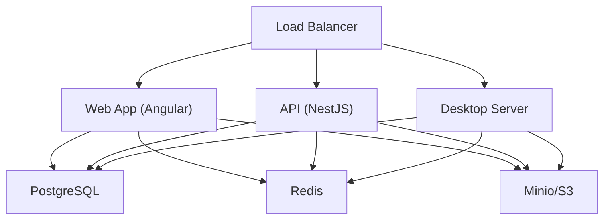

# Deployment Overview

Ever Gauzy supports multiple deployment strategies from simple Docker containers to full Kubernetes orchestration.

## Deployment Options

| Method             | Complexity | Best For                            |
| ------------------ | :--------: | ----------------------------------- |
| **Docker Compose** |     ⭐     | Development, small teams            |
| **Docker + Nginx** |    ⭐⭐    | Single-server production            |
| **Kubernetes**     |   ⭐⭐⭐   | Scalable production                 |
| **DigitalOcean**   |    ⭐⭐    | Managed cloud hosting               |
| **AWS**            |   ⭐⭐⭐   | Enterprise cloud                    |
| **Terraform**      |   ⭐⭐⭐   | Infrastructure as Code              |
| **Pulumi**         |   ⭐⭐⭐   | Infrastructure as Code (TypeScript) |

## Architecture



## Container Images

| Image                               | Description        | Port |
| ----------------------------------- | ------------------ | :--: |
| `ghcr.io/ever-co/gauzy-api`         | Backend API server | 3000 |
| `ghcr.io/ever-co/gauzy-webapp`      | Angular web app    | 4200 |
| `ghcr.io/ever-co/gauzy-api-demo`    | Demo API (seeded)  | 3000 |
| `ghcr.io/ever-co/gauzy-webapp-demo` | Demo webapp        | 4200 |

## Minimum Requirements

### Development

| Resource | Minimum |
| -------- | ------- |
| CPU      | 2 cores |
| RAM      | 4 GB    |
| Disk     | 10 GB   |
| Node.js  | 18+     |

### Production

| Resource | Minimum        | Recommended   |
| -------- | -------------- | ------------- |
| CPU      | 2 cores        | 4+ cores      |
| RAM      | 4 GB           | 8+ GB         |
| Disk     | 20 GB          | 50+ GB        |
| Database | PostgreSQL 14+ | PostgreSQL 16 |

## Environment Variables

Critical production environment variables:

```bash
# Application
NODE_ENV=production
API_BASE_URL=https://api.yourdomain.com
CLIENT_BASE_URL=https://app.yourdomain.com

# Database
DB_TYPE=postgres
DB_HOST=your-db-host
DB_PORT=5432
DB_NAME=gauzy
DB_USER=gauzy_user
DB_PASS=secure-password
DB_SSL_MODE=true

# Security
JWT_SECRET=your-very-secure-jwt-secret
JWT_REFRESH_TOKEN_SECRET=your-refresh-secret

# File Storage
FILE_PROVIDER=S3
AWS_ACCESS_KEY_ID=your-key
AWS_SECRET_ACCESS_KEY=your-secret
AWS_S3_BUCKET=your-bucket
AWS_REGION=us-east-1
```

## Related Pages

- [Docker Setup](./docker/docker-setup) — Docker container guide
- [Docker Compose](./docker/docker-compose) — multi-container setup
- [Kubernetes](./kubernetes) — K8s deployment
- [CI/CD Overview](./ci-cd/ci-cd-overview) — automation pipelines
