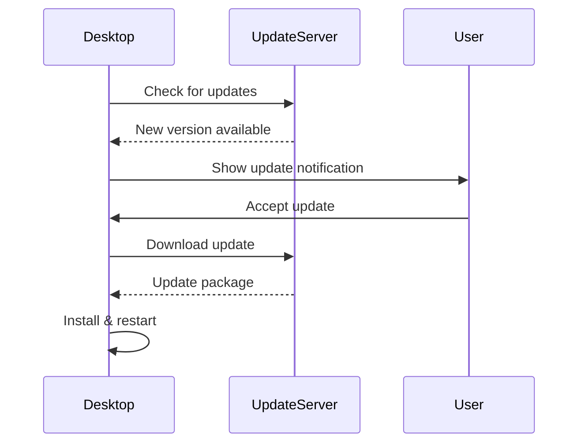

# Desktop Auto-Updater Deep Dive

Automatic update mechanism for the Gauzy Desktop application.

## Overview

The auto-updater uses Electron Builder's built-in update mechanism, which supports:

- GitHub Releases (default)
- Custom update server
- S3/DigitalOcean Spaces

## Update Flow



## Configuration

```json
{
  "publish": {
    "provider": "github",
    "owner": "ever-co",
    "repo": "ever-gauzy"
  }
}
```

## Update Channels

| Channel | Purpose           |
| ------- | ----------------- |
| latest  | Stable releases   |
| beta    | Beta testing      |
| alpha   | Early development |

## Platform-Specific

| Platform | Update Format   | Auto-Install |
| -------- | --------------- | ------------ |
| Windows  | `.exe` NSIS     | Yes          |
| macOS    | `.dmg` / `.zip` | Yes (signed) |
| Linux    | `.AppImage`     | Yes          |

## Manual Check

Users can trigger an update check: **Settings** → **About** → **Check for Updates**

## Related Pages

- [Desktop Overview](./desktop-overview) — desktop guide
- [Desktop Builds](./desktop-builds) — build process
- [Release Process](../development/release-process) — releases
