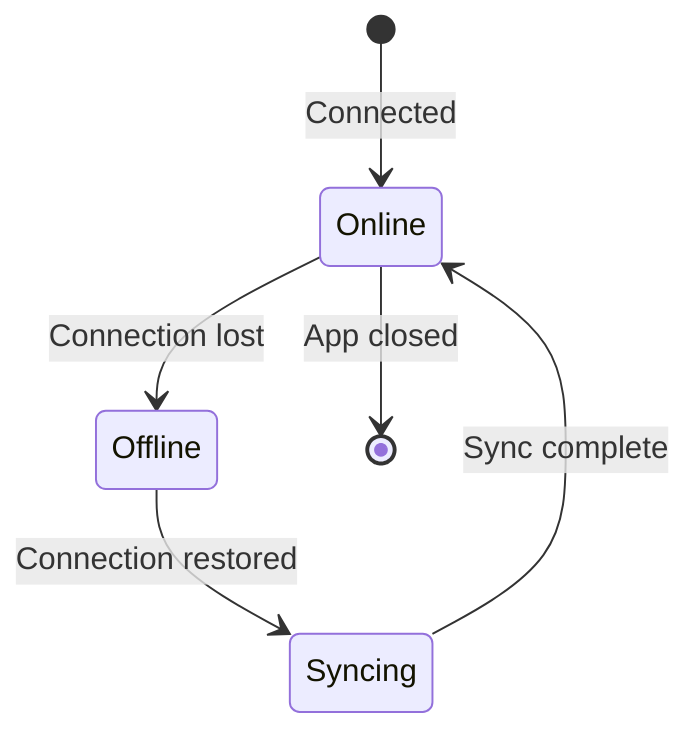

# Desktop Offline Mode

Track time offline and sync when connectivity returns.

## How Offline Mode Works

1. Desktop app detects loss of API connectivity
2. Timer continues running locally
3. Time entries, screenshots, and activity data are stored locally
4. When connection restores, data syncs automatically

## Local Storage

During offline mode, data is stored in:

| Platform | Location                                             |
| -------- | ---------------------------------------------------- |
| Windows  | `%APPDATA%/gauzy-desktop/queue/`                     |
| macOS    | `~/Library/Application Support/gauzy-desktop/queue/` |
| Linux    | `~/.config/gauzy-desktop/queue/`                     |

## What's Stored Offline

| Data            | Stored | Synced on Reconnect |
| --------------- | ------ | ------------------- |
| Time entries    | ✅     | ✅                  |
| Screenshots     | ✅     | ✅                  |
| Activity levels | ✅     | ✅                  |
| Task selection  | ✅     | ✅                  |
| Project changes | ❌     | ❌                  |

## Sync Process

When connectivity returns:

1. Queue processor starts
2. Oldest entries synced first
3. Progress indicator shown
4. Conflicts resolved (server wins)
5. Local queue cleared

## Limitations

- Cannot create new tasks/projects offline
- Cannot view team data offline
- Maximum offline duration: configurable (default 24 hours)
- Screenshot uploads may be slow on large queues

## Related Pages

- [Desktop Timer](./desktop-timer) — timer features
- [Desktop Troubleshooting](../troubleshooting/desktop-app-issues) — issues
