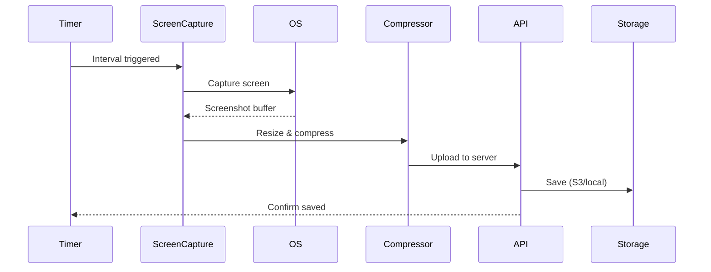

# Screenshots Deep Dive

Detailed guide to screenshot capture, configuration, and privacy.

## How Screenshots Work

## Configuration

### Organization Settings

| Setting             | Description              | Default |
| ------------------- | ------------------------ | ------- |
| Screenshots enabled | Enable/disable globally  | On      |
| Interval (min)      | Time between captures    | 10      |
| Quality             | Image quality (%)        | 85      |
| Blur mode           | Blur screenshot content  | Off     |
| Random interval     | Randomize capture timing | Off     |

### Per-Employee Override

Managers can override screenshot settings per employee.

## Screenshot Storage

Screenshots are stored using the configured file provider:

- **Local** — `./uploads/screenshots/`
- **S3** — `s3://bucket/screenshots/`
- **Wasabi/Cloudinary** — respective providers

## Privacy Features

### Blur Mode

When enabled, screenshots are blurred before upload, protecting sensitive content while still showing activity.

### Notification

Employees can see:

- When a screenshot is taken (tray notification)
- All their own screenshots
- Option to delete within 5 minutes (configurable)

### Delete Policy

| Policy           | Description                   |
| ---------------- | ----------------------------- |
| Immediate delete | Employee can delete instantly |
| Timed delete     | Delete within N minutes       |
| No delete        | Only managers can delete      |

## Viewing Screenshots

### As Employee

Go to **Time Tracking** → **Screenshots** to view your own captures.

### As Manager

Go to **Employees** → select employee → **Activity** → **Screenshots**.

## Related Pages

- [Activity Tracking](../features/activity-tracking-deep-dive) — activity monitoring
- [Desktop Timer](./desktop-timer) — timer features
- [File Storage](../architecture/file-storage) — storage architecture
