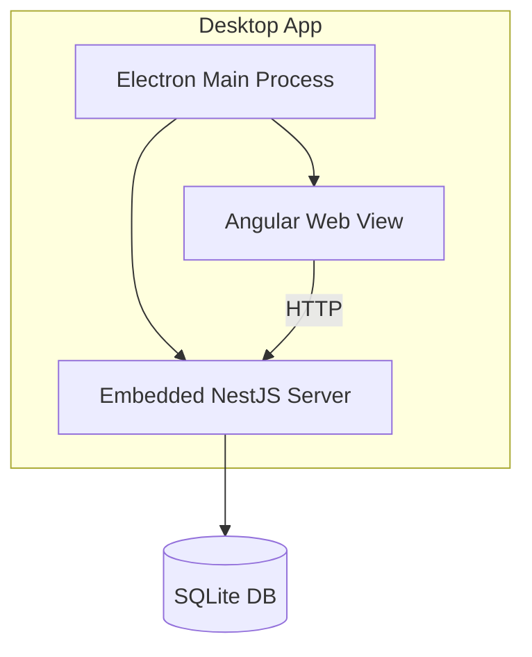

# Desktop Server Mode

Run the embedded API server from the Gauzy Desktop app.

## Overview

Gauzy Desktop can run in **Server Mode**, which embeds a fully functional NestJS API server alongside the Electron desktop app. This is useful for:

- Standalone deployments without a separate server
- Small team setups
- Offline-first environments

## Enabling Server Mode

1. Open Desktop Settings
2. Toggle **Server Mode** → ON
3. Configure:
   - Port (default: 5620)
   - Database type (SQLite or PostgreSQL)
   - Auto-start on boot
4. Click **Start Server**

## Server Configuration

| Setting    | Default     | Description                |
| ---------- | ----------- | -------------------------- |
| Port       | 5620        | API server port            |
| DB Type    | SQLite      | Database backend           |
| DB Path    | `~/.gauzy/` | Database file location     |
| Auto-start | Off         | Start server on app launch |
| Background | Yes         | Run in system tray         |

## Architecture



## Accessing the API

Once running, the API is available at:

```
http://localhost:5620/api
```

## Limitations

- SQLite only supports single-user concurrent access
- No Redis support in embedded mode
- Performance limited by desktop hardware

## Related Pages

- [Desktop Overview](./desktop-overview) — desktop app guide
- [Desktop Builds](./desktop-builds) — building from source
