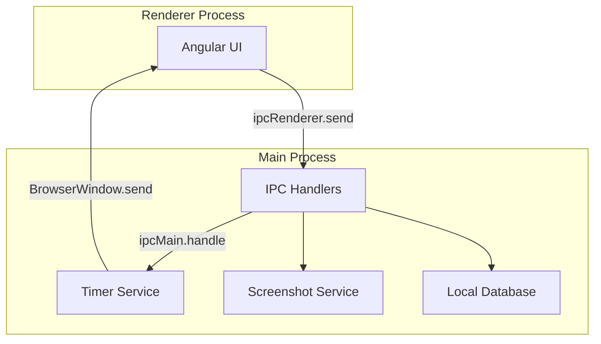

# Electron IPC Communication

Inter-process communication between Electron main and renderer processes.

## Overview

The Gauzy desktop app uses Electron's IPC (Inter-Process Communication) for:

- Timer controls from renderer → main
- Screenshot capture from main → renderer
- Activity data collection
- Settings synchronization

## Architecture



## Common IPC Channels

| Channel            | Direction       | Description         |
| ------------------ | --------------- | ------------------- |
| `timer:start`      | Renderer → Main | Start timer         |
| `timer:stop`       | Renderer → Main | Stop timer          |
| `timer:status`     | Main → Renderer | Timer state update  |
| `screenshot:taken` | Main → Renderer | Screenshot captured |
| `settings:update`  | Both            | Settings changed    |
| `app:minimize`     | Renderer → Main | Minimize to tray    |

## Renderer → Main

```typescript
// In Angular component/service
const { ipcRenderer } = window.require("electron");

ipcRenderer.send("timer:start", {
  projectId: "uuid",
  taskId: "uuid",
});

ipcRenderer.on("timer:status", (event, data) => {
  // Update UI with timer state
});
```

## Main → Renderer

```typescript
// In Electron main process
ipcMain.on("timer:start", (event, data) => {
  timerService.start(data);
  // Send status back
  mainWindow.webContents.send("timer:status", { running: true });
});
```

## Related Pages

- [Desktop Overview](./desktop-overview) — desktop guide
- [Desktop Server Mode](./desktop-server-mode) — embedded server
