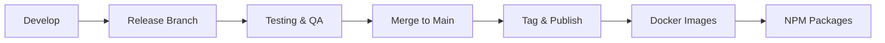

# Release Process

How releases are prepared, tested, and published.

## Versioning

Ever Gauzy follows [Semantic Versioning](https://semver.org/):

- **MAJOR** — breaking changes
- **MINOR** — new features (backward-compatible)
- **PATCH** — bug fixes

## Release Workflow



### 1. Create Release Branch

```bash
git checkout develop
git pull
git checkout -b release/1.5.0
```

### 2. Update Version

```bash
yarn version --new-version 1.5.0 --no-git-tag-version
```

### 3. Testing

- Run full test suite
- Deploy to staging environment
- Manual QA verification

### 4. Merge & Tag

```bash
git checkout main
git merge release/1.5.0
git tag -a v1.5.0 -m "Release 1.5.0"
git push origin main --tags
```

### 5. Automated Publish

CI/CD pipelines automatically:

- Build Docker images
- Publish to GHCR
- Publish NPM packages
- Deploy to production

## Release Artifacts

| Artifact      | Registry / Location            |
| ------------- | ------------------------------ |
| Docker Images | `ghcr.io/ever-co/gauzy-*`      |
| NPM Packages  | `packages.ever.co` (Verdaccio) |
| Desktop Apps  | GitHub Releases                |

## Related Pages

- [Git Workflow](./git-workflow) — branching model
- [Contributing](./contributing) — contribution guide
- [Private Registry](../devops/private-registry) — Verdaccio
