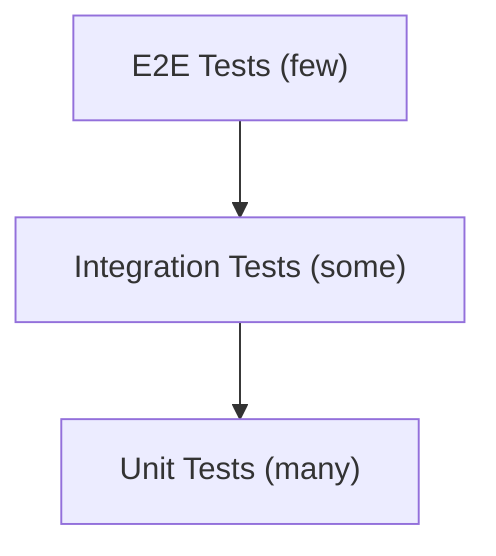

# Testing Strategy

Unit, integration, and end-to-end testing approaches for Ever Gauzy.

## Test Pyramid



## Unit Tests

Unit tests verify individual functions, services, and pipes.

### Running

```bash
# Run all unit tests
yarn test

# Run with coverage
yarn test --coverage

# Watch mode
yarn test --watch
```

### Example: Service Test

```typescript
describe("EmployeeService", () => {
  let service: EmployeeService;
  let repository: MockRepository<Employee>;

  beforeEach(async () => {
    const module = await Test.createTestingModule({
      providers: [
        EmployeeService,
        { provide: getRepositoryToken(Employee), useClass: MockRepository },
      ],
    }).compile();

    service = module.get<EmployeeService>(EmployeeService);
    repository = module.get(getRepositoryToken(Employee));
  });

  it("should find all employees", async () => {
    const employees = [{ id: "1", name: "John" }];
    repository.find.mockResolvedValue(employees);

    const result = await service.findAll();
    expect(result).toEqual(employees);
  });
});
```

## Integration Tests

Integration tests verify API endpoints with a real database:

```typescript
describe("EmployeeController (e2e)", () => {
  let app: INestApplication;

  beforeAll(async () => {
    const module = await Test.createTestingModule({
      imports: [AppModule],
    }).compile();

    app = module.createNestApplication();
    await app.init();
  });

  it("/api/employee (GET)", () => {
    return request(app.getHttpServer())
      .get("/api/employee")
      .set("Authorization", `Bearer ${token}`)
      .expect(200)
      .expect((res) => {
        expect(res.body.items).toBeInstanceOf(Array);
      });
  });
});
```

## Frontend Tests

```bash
# Angular component tests
yarn nx test gauzy --watch

# Specific test file
yarn nx test gauzy --testPathPattern=task.component.spec.ts
```

## Related Pages

- [E2E Testing](./e2e-testing) — end-to-end testing
- [API Testing](./api-testing) — API test patterns
- [Coding Standards](./coding-standards) — code quality
