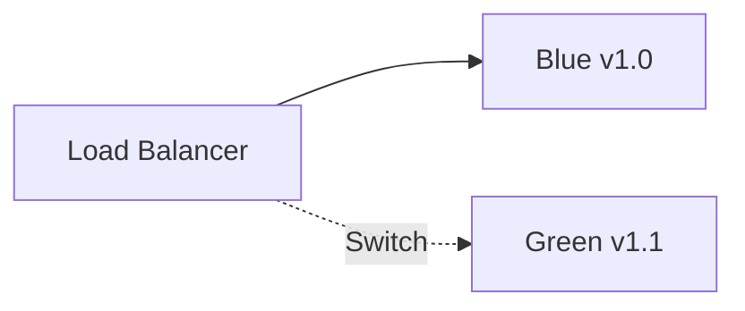
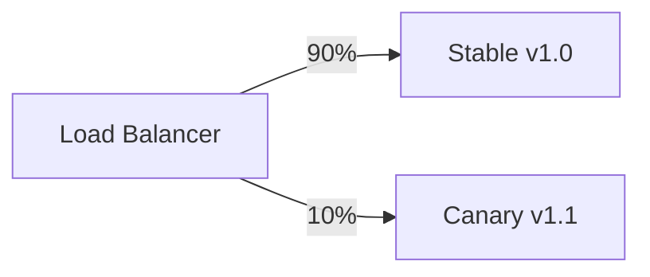

# Blue-Green and Canary Deployments

Zero-downtime deployment strategies for Ever Gauzy.

## Blue-Green Deployment



### Process

1. **Blue** is the current production (v1.0)
2. **Green** is deployed with new version (v1.1)
3. Run smoke tests against Green
4. Switch load balancer to Green
5. Blue becomes standby for rollback

### Kubernetes Implementation

```yaml
# service.yaml
apiVersion: v1
kind: Service
metadata:
  name: gauzy-api
spec:
  selector:
    app: gauzy-api
    version: green # Switch between blue/green
  ports:
    - port: 3000
```

### Rollback

Simply switch the service selector back to `version: blue`.

## Canary Deployment



### Process

1. Deploy canary (v1.1) alongside stable (v1.0)
2. Route 10% of traffic to canary
3. Monitor error rates and latency
4. Gradually increase canary traffic
5. Full rollout or rollback

### Nginx Canary

```nginx
upstream gauzy {
    server api-v1:3000 weight=9;
    server api-v2:3000 weight=1;
}
```

## Related Pages

- [Production Deployment](./production-deployment) — deployment guide
- [CI/CD Pipeline](../deployment/ci-cd/cicd-pipeline-guide) — CI/CD
- [Health Checks](../observability/health-checks) — health monitoring
