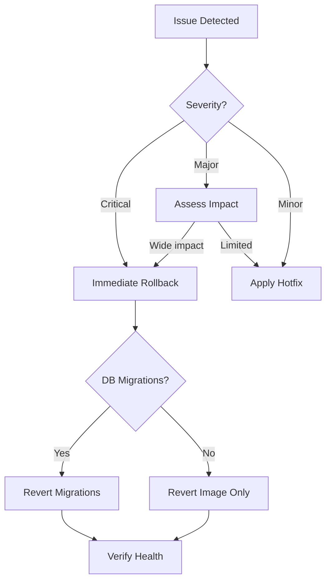

# Rollback Strategies

Roll back failed deployments safely.

## Kubernetes Rollback

```bash
# Instant rollback to previous revision
kubectl rollout undo deployment/gauzy-api

# Rollback to specific revision
kubectl rollout history deployment/gauzy-api
kubectl rollout undo deployment/gauzy-api --to-revision=3

# Check rollout status
kubectl rollout status deployment/gauzy-api
```

## Docker Rollback

```bash
# Run previous image tag
docker service update --image ghcr.io/ever-co/gauzy-api:v1.2.3 gauzy-api

# Docker Compose - revert to previous tag
docker compose pull
docker compose up -d
```

## Database Rollback

If the release included migrations:

```bash
# TypeORM
yarn typeorm migration:revert

# MikroORM
npx mikro-orm migration:down
```

## Rollback Decision Tree



## Pre-Rollback Checklist

- [ ] Confirm the issue is deployment-related
- [ ] Identify the last known good version
- [ ] Check if data migrations need reverting
- [ ] Notify team and stakeholders
- [ ] Have monitoring dashboards open

## Post-Rollback

- [ ] Verify service health
- [ ] Check error rates returning to baseline
- [ ] Document the rollback
- [ ] Root cause analysis
- [ ] Fix forward with new release

## Related Pages

- [Release Management](../workflows/release-management) — releases
- [Blue-Green Deployment](./blue-green-deployment) — zero-downtime
- [Disaster Recovery](./disaster-recovery) — DR planning
