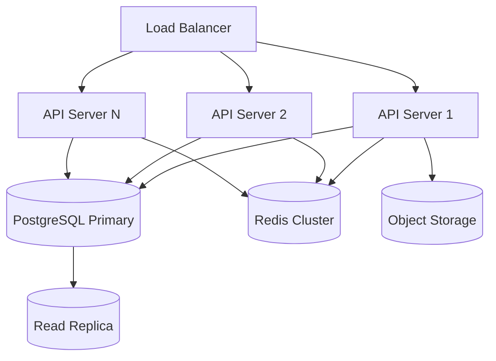

# Scaling & High Availability

Scale Ever Gauzy for enterprise workloads with horizontal scaling and high availability.

## Architecture



## Horizontal Scaling

### API Servers

Run multiple API server instances behind a load balancer:

```yaml
# docker-compose.yml
services:
  api:
    image: ghcr.io/ever-co/gauzy-api:latest
    deploy:
      replicas: 3
```

### Requirements for Multi-Instance

| Requirement           | Description                                 |
| --------------------- | ------------------------------------------- |
| Redis                 | Required for session storage and job queues |
| External file storage | Use S3/Wasabi instead of local storage      |
| Stateless API         | No in-memory state between requests         |
| Database pooling      | Use PgBouncer for connection pooling        |

## Database Scaling

### Read Replicas

Configure read replicas for read-heavy workloads:

```
DB_REPLICATION=true
DB_REPLICA_HOST=replica.db.host
```

### Connection Pooling

Use PgBouncer for efficient connection management:

```ini
[databases]
gauzy = host=localhost dbname=gauzy

[pgbouncer]
pool_mode = transaction
max_client_conn = 1000
default_pool_size = 40
```

## Redis Clustering

For high availability, use Redis Sentinel or Redis Cluster:

```
REDIS_HOST=sentinel-host
REDIS_PORT=26379
REDIS_SENTINEL_MASTER=mymaster
```

## Related Pages

- [Production Deployment](./production-deployment) — initial setup
- [Monitoring](./monitoring) — production monitoring
