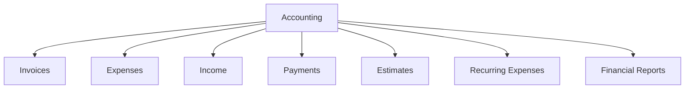

# Accounting Overview

Financial management capabilities in Ever Gauzy.

## Modules

## Invoicing

| Feature          | Description                    |
| ---------------- | ------------------------------ |
| Create invoices  | From time logs, manual entries |
| Templates        | Customizable invoice templates |
| Multi-currency   | Support for 150+ currencies    |
| Tax calculation  | Configurable tax rates         |
| Payment tracking | Track partial/full payments    |

## Expense Tracking

| Feature            | Description               |
| ------------------ | ------------------------- |
| One-time expenses  | Manual or receipt-based   |
| Recurring expenses | Automated periodic costs  |
| Categories         | Custom expense categories |
| Approval workflow  | Submit → Review → Approve |

## Financial Reports

| Report                | Description                 |
| --------------------- | --------------------------- |
| Income vs Expenses    | Revenue and cost comparison |
| Profit & Loss         | Net profit over period      |
| Outstanding Invoices  | Unpaid invoice summary      |
| Expense by Category   | Expense breakdown           |
| Client Revenue        | Revenue per client          |
| Project Profitability | Revenue vs cost per project |

## Tax Configuration

1. Go to **Settings** → **Tax**
2. Add tax rates:
   - Name (e.g., "VAT", "Sales Tax")
   - Rate (e.g., 20%)
   - Apply to: Products, Services, or Both
3. Set default tax rate

## Related Pages

- [Invoice Management](./invoice-management) — invoicing
- [Expense Tracking](./expense-tracking) — expenses
- [Payment Gateways](./payment-gateways) — payment setup
- [Reports](./reports-and-analytics) — reporting
