# Activity Tracking Deep Dive

Monitor employee activity levels, app usage, and productivity.

## Overview

Activity tracking records:

- Active vs idle time percentages
- Application usage
- URL visited (optional)
- Screenshots at intervals
- Mouse and keyboard activity levels

## Activity Levels

| Level       | Mouse/Keyboard Activity |
| ----------- | ----------------------- |
| Very Active | > 75%                   |
| Active      | 50-75%                  |
| Low         | 25-50%                  |
| Idle        | < 25%                   |

## Time Slots

Time is divided into 10-minute slots. Each slot records:

- Activity percentage
- Screenshots
- App usage
- Keyboard/mouse counts

```mermaid
gantt
    title Time Slot Example (1 hour)
    dateFormat HH:mm
    axisFormat %H:%M
    section Slots
    Slot 1 (85% active) :09:00, 10min
    Slot 2 (92% active) :09:10, 10min
    Slot 3 (45% idle) :09:20, 10min
    Slot 4 (78% active) :09:30, 10min
    Slot 5 (88% active) :09:40, 10min
    Slot 6 (95% active) :09:50, 10min
```

## Screenshot Configuration

| Setting             | Description                  |
| ------------------- | ---------------------------- |
| Screenshot interval | How often (5-15 min)         |
| Quality             | Image quality/resolution     |
| Blur mode           | Blur screenshots for privacy |
| Enabled/Disabled    | Per organization setting     |

## Privacy Considerations

- Activity tracking is opt-in per organization
- Employees can be notified when screenshots are taken
- Blur mode available for privacy-sensitive environments
- Data retention policies configurable

## API

See [Activity Log Endpoints](../api/activity-log-endpoints) for querying activity data.

## Related Pages

- [Time Tracking](./time-tracking) — time tracking
- [Desktop Timer](../desktop/desktop-timer) — desktop app
