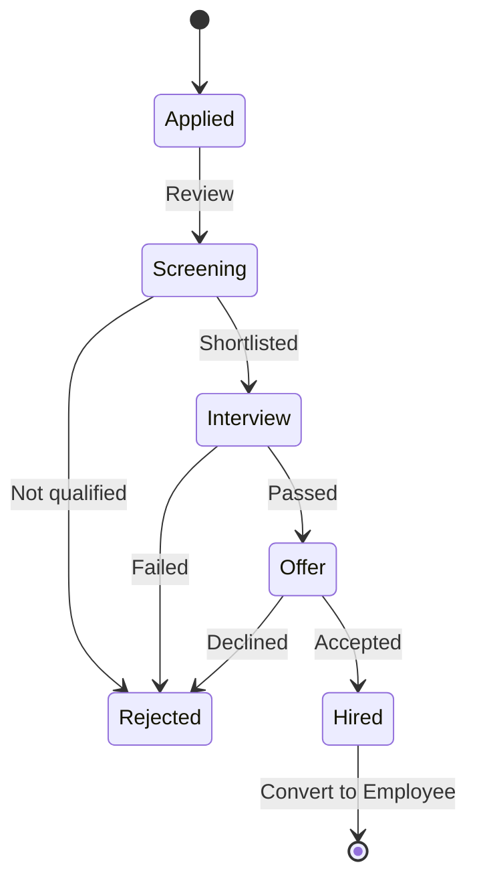

# Candidate Management

Manage recruitment pipeline and job candidates.

## Overview

The candidate management module supports the full recruitment lifecycle:

- Job posting
- Application tracking
- Interview scheduling
- Feedback collection
- Hiring decisions

## Candidate Lifecycle

## Creating Candidates

1. Go to **Candidates** → **Add Candidate**
2. Enter:
   - Name and contact info
   - Resume/CV upload
   - Applied position
   - Source (LinkedIn, referral, etc.)
   - Skills
3. Save

## Candidate Profile

| Tab        | Content                    |
| ---------- | -------------------------- |
| Overview   | Basic info, rating, status |
| Interview  | Scheduled interviews       |
| Experience | Work history, education    |
| Skills     | Technical and soft skills  |
| Documents  | Resume, cover letter, etc. |
| Feedback   | Interviewer feedback       |

## Interviewer Feedback

After each interview round, interviewers can submit feedback:

- Rating (1-5 stars)
- Technical assessment
- Cultural fit assessment
- Notes and recommendations
- Hire/No Hire decision

## Converting to Employee

When a candidate is hired:

1. Click **Hire** on candidate profile
2. Employee record is auto-created with candidate data
3. Candidate status is updated to HIRED
4. Start onboarding process

## Related Pages

- [Employee Appointments](./employee-appointments) — scheduling
- [Employee Management](./employee-management) — employee features
