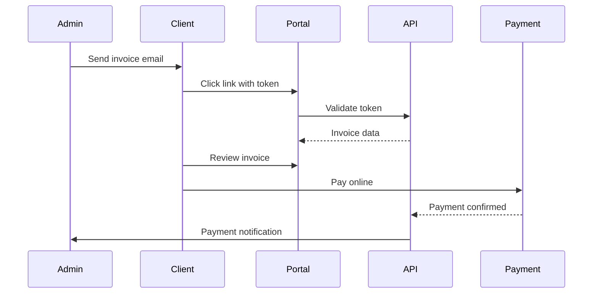

# Client Portal

External-facing portal for client collaboration.

## Overview

The client portal provides a self-service interface for clients to:

- View project progress
- Review and approve invoices
- View estimates and proposals
- Communicate via comments
- Track billable hours

## Access

Clients access the portal via:

```
https://your-domain.com/share/invoice/{token}
https://your-domain.com/share/estimate/{token}
```

Tokens are auto-generated and sent via email.

## Portal Features

| Feature           | Description                    |
| ----------------- | ------------------------------ |
| Invoice viewing   | See all invoices for their org |
| Invoice payment   | Pay via Stripe/PayPal          |
| Estimate approval | Accept/reject estimates        |
| Project dashboard | View project progress          |
| Time log summary  | See hours billed               |
| Document access   | Download shared documents      |

## Public Invoice Flow



## Security

- Token-based access (no login required)
- Tokens expire after configurable period
- Rate-limited public endpoints
- Relation whitelisting on public data

## Related Pages

- [Invoice Management](./invoicing) — invoicing
- [Estimate Endpoints](../api/estimate-endpoints) — estimates API
- [Public API Endpoints](../api/public-api-endpoints) — public endpoints
