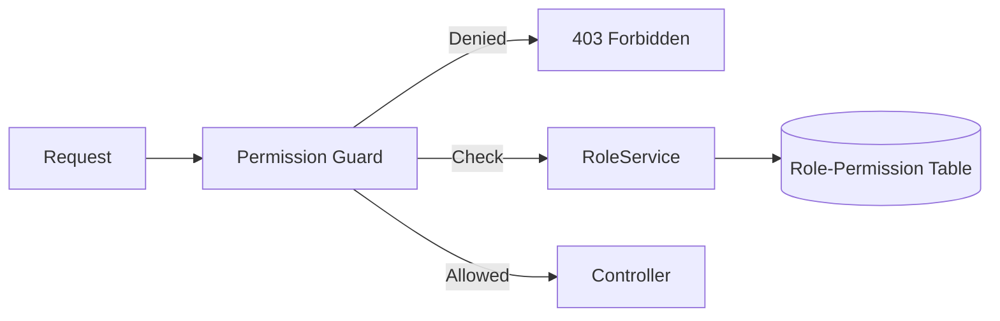

# Custom Roles & Permissions

Define custom roles with granular permission control.

## Default Roles

| Role        | Access Level             |
| ----------- | ------------------------ |
| SUPER_ADMIN | Full system access       |
| ADMIN       | Organization management  |
| MANAGER     | Team management          |
| EMPLOYEE    | Self-service access      |
| CANDIDATE   | Limited application view |
| VIEWER      | Read-only access         |

## Creating Custom Roles

1. Go to **Settings** → **Roles & Permissions**
2. Click **Add Role**
3. Enter role name
4. Select permissions from categories

## Permission Categories

| Category      | Examples                         |
| ------------- | -------------------------------- |
| Organization  | View org, edit org, manage teams |
| Employee      | View employees, edit, delete     |
| Time Tracking | View time, approve timesheets    |
| Projects      | Create, edit, delete projects    |
| Tasks         | Create, assign, manage status    |
| Financial     | View invoices, create, approve   |
| Reports       | View reports, export data        |
| Admin         | Manage roles, integrations       |

## Permission Enforcement

Permissions are enforced at multiple layers:



### Guard-Based

```typescript
@UseGuards(PermissionGuard)
@Permissions(PermissionsEnum.ORG_EMPLOYEES_EDIT)
@Put(':id')
async update(@Param('id') id: string, @Body() dto: UpdateDTO) {
  return this.service.update(id, dto);
}
```

## API

```
GET /api/role
POST /api/role
GET /api/role/:id/permissions
PUT /api/role/:id/permissions
```

## Related Pages

- [Guard System](../architecture/guard-system) — guards
- [Tenant Isolation](../security/tenant-isolation) — tenant security
- [Organization Settings](./organization-settings) — org config
